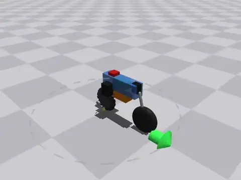
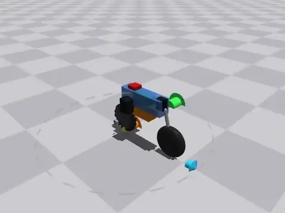
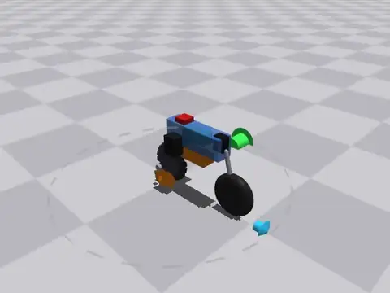
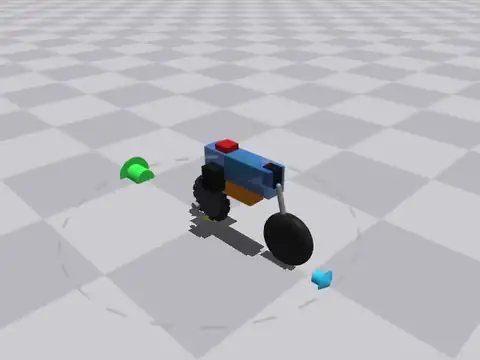

<h1 align="center">aow-bike-sim</h1>

<p align="center">
  🚧 🏗️ 🚧 <b>UNDER CONSTRUCTION</b> 🚧 🏗️ 🚧<br>
</p>

<p align="center">
  <em>A self-balancing RC bike whose rear wheel can also drive sideways.</em>
</p>

<p align="center">
  <a href="#how-it-works">How it works</a> ·
  <a href="#install">Installing</a> ·
  <a href="#drive-it">Driving</a> ·
  <a href="#training-policies">Training</a> ·
  <a href="#physical-build">Hardware</a>
</p>

---

## Demo

Four commands from the control policy's **evaluation grid**: the same commands
that reinforcement learning training runs are scored on. Simulated; **real footage goes beside these once the bike is assembled**.

<!--
  Committed animated WebPs, so they loop on their own and render in a clone.
  docs/guide/media.md has the exact command behind each one, which policy, and the
  GitHub-attachment route for anything too long to commit.
-->

<table>
<tr>
<td width="50%"></td>
<td width="50%"></td>
</tr>
<tr>
<td><b>It balances.</b> Zero input command.</td>
<td><b>It turns.</b> Forward 0.8 m/s, 90° heading step.</td>
</tr>

<tr>
<td width="50%"></td>
<td width="50%"></td>
</tr>
<tr>
<td><b>It reverses.</b> Reverse 0.5 m/s, 90° heading step.</td>
<td><b>It spins.</b> 180° turnaround.</td>
</tr>
</table>

Commanded heading and velocity are drawn on a dial under the bike (green and orange), against what it actually achieved (cyan and yellow). The red line is 1 s of rear wheel position history.

## How it works

The rear wheel is an **active omni wheel** extracted from a toy RC bike. Two servos drive it as a differential: turn them together and the wheel rolls, turn them in opposite directions and the wheel drives *sideways*. While stationary, it uses the sideways actuation to maintain balance. A third servo steers (continuous, 360°+), a fourth servo drives a self-righting mechanism (in case it falls), and an AHRS measures orientation.

This repo is the **simulator and the control stack**: a parametric MuJoCo model built from a measured parameter file, the RL training that produces the policies, and the onboard code that runs them on the bike. The physical bike is [under construction](docs/guide/physical-build.md): the control loop has been proven against real servos and a real AHRS, but the full bike is still being assembled.

**A single reinforcement learning policy drives it.** A `general_rl*` policy balances the bike and tracks a live (velocity vector, heading) command at 50 Hz. It has no horizon and no hand-back: engage it once and it runs indefinitely. The contract shared by training and replay is [`control/general_spec.py`](src/aow_sim/control/general_spec.py). A trained policy exports as **numpy weights plus a yaml**, so it is lightweight (i.e. no PyTorch).

**An LQR controller also exists as reference baseline**. This controller is maintained in a 'best effort' manner but is quite sensitive to contact model changes.

**The same controller code runs on the bike.** `hw/state.py` provides a `HardwareData` shim that quacks like MuJoCo's `mjData`, so `DriveController` runs on the robot unmodified. The onboard code never imports MuJoCo or scipy — a test enforces that — and gets its LQR gains from a digest-pinned deploy bundle instead.


## Install

Python 3.11+.

```sh
python -m venv .venv && source .venv/bin/activate
pip install -e '.[dev]'
```

or, with conda:

```sh
conda create -n aow-sim python=3.12 -y && conda activate aow-sim
pip install -e '.[dev]'
```

`[dev]` is sufficient for working on the simulator. Extras such as `[rl]` for remote RL training or `[onboard]` for talking to hardware:

| extra | pulls in | when you need it |
|---|---|---|
| *(base)* | mujoco, numpy, pyyaml, scipy | run the sim, replay a trained policy |
| `dev` | pytest, xdist, matplotlib, imageio | everything below except `rl` and `onboard` |
| `viz` | matplotlib, imageio, imageio-ffmpeg | `aow_sim.record`, and the PNGs the tools write beside their CSVs |
| `teleop` | pyobjc (macOS only) | **hold-to-drive.** Without it the arrow keys still work, but only tap-by-tap — MuJoCo's viewer reports key-down and nothing else, so real key state has to come from the OS |
| `rl` | gymnasium, SB3, torch, tensorboard | *training only.* Replaying an exported policy needs numpy alone |
| `onboard` | pyserial, dynamixel-sdk | talking to real servos and the AHRS, from a laptop. **Not** how you install on the bike: the base dependencies are unconditional, so this drags MuJoCo along with it |

## Drive it

```sh
mjpython -m aow_sim.run_drive --teleop
```

**`mjpython`, not `python`, for anything with an interactive viewer**. Headless tools (`record`, `rollout_move`, the trainers) run under plain `python` anywhere, including over ssh.

It drives like an RC bike. The basics:

| key | what it does |
|---|---|
| `↑` / `↓` | throttle / brake into reverse. Tap to step 0.25 m/s, hold to build, release to coast back to zero |
| `←` / `→` | turn. Heading is a *setpoint* — it stays where you leave it |
| `1` / `3` | **crab left / right** — sideways, heading held |
| `6` / `7` / `8` | snap the heading 90° left / 90° right / 180° |
| `5` | stop now, laterally as well |
| `,` | policy menu — pick which trained policy is driving, live |
| `\` | camera: free → follow → overhead → rear wheel |

Bindings are digits, arrows and punctuation to avoid ghosting the MuJoCo's viewer's defaults (A–Z).

**The real bike takes the same commands.** The operator sends a whole command struct (velocity vector, heading, mode) over UDP. Run with:

```sh
mjpython -m aow_sim.run_drive --mirror aowbike.local
```

Same key map, no simulated physics: every pose in the viewer is now telemetry coming back from the bike over UDP.

**Full key reference, every mode, the ground dial, the policy menu, slow motion and the self-righting layer: [docs/guide/teleop.md](docs/guide/teleop.md).**

Other useful scripts:

```sh
python -m aow_sim.view --training-wheels    # open-loop viewer, bike propped up
python -m aow_sim.run_balance --view        # the LQR baseline balancing
python -m aow_sim.run_drive                 # headless: sprints, circles, envelopes
```

## Training policies

Training needs the `rl` extra; replaying an export does not.

```sh
pip install -e '.[rl]'
python -m aow_sim.train_general_rl          # -> moves/general_rl.{yaml,npz}
```

The trainer keeps the best-scoring snapshot from a periodic deterministic eval and exports *that*. Hyperparameters, reward weights and domain randomization live in `config/rl_general*.yaml`; learning curves are `tensorboard --logdir runs/general_rl`.

**[docs/guide/training.md](docs/guide/training.md)** covers exporting a mid-run checkpoint, inspecting a policy, and recording video of trained policies.

## Physical build

The physical bike is **under construction**. Several subassemblies exist and the control loop is proven on real servos and a real AHRS at 100 Hz, but the subassemblies are still being integrated. Four Dynamixel servos, one AHRS, one single-board computer, one battery.

The **CAD is generated from the same parameter file the simulator reads**: `aow_sim.cad_layout` emits FeatureScript straight into Onshape, pinning the sim and physical model together.

**[docs/guide/physical-build.md](docs/guide/physical-build.md)** explains what the machine is, how it's wired, the CAD workflow, bring-up, and failsafes.

## Repo map

| path | what is in it |
|---|---|
| `config/bike_params.yaml` | every physical measurement, with units and provenance: `measured` / `tooth-count` / `datasheet` / `GUESS`. `GUESS` means "placeholder, still to be identified" |
| `config/rl_*.yaml` | per-move training configs — algorithm, env, reward weights, domain randomization |
| `src/aow_sim/` | the parametric model builder (`mjSpec`), procedural contact meshes, viewer, runners, offline optimizers and trainers |
| `src/aow_sim/control/` | `drive.py` is the controller that runs everywhere, in sim and on the bike, and `general_spec.py` is the observation/action contract training and replay share. Alongside them: the multi-turn steering frame, shared state extraction, and the LQR baseline |
| `src/aow_sim/hw/` | the onboard stack: Dynamixel bus, TM151 reader, velocity estimation, the 100 Hz control loop, the ground station. Imports without MuJoCo, scipy or torch |
| `analysis/` | one-off studies that ask a question of existing artifacts and change nothing. Tracked figures land in `analysis/plots/` |
| `moves/` | trained policies: `*.yaml` plus `*.npz` weights |
| `scripts/` | launchers and generators, including the one that rebuilds the clips above |
| `tests/` | compilation, coupling-ratio, envelope and behaviour tests. Every file carries a marker saying what invalidates it — `pytest --markers` |
| `docs/guide/` | the pages linked above |
| `docs/plans/` | design records: the reasoning, the measurements, the options rejected and why. Each opens with a status banner |
| `docs/measurements/` | hand-entered protocol/data pairs — what to measure, how, and the numbers that came back |

`runs/` (training checkpoints and tensorboard logs) and `traces/` (diagnostic plots and video) are gitignored.

## Credits

The rear wheel was obtained from an HC-802 RC bike; the omni-wheel geometry was reverse-engineered from a teardown. Built on [MuJoCo](https://mujoco.org) and [Stable-Baselines3](https://stable-baselines3.readthedocs.io).
