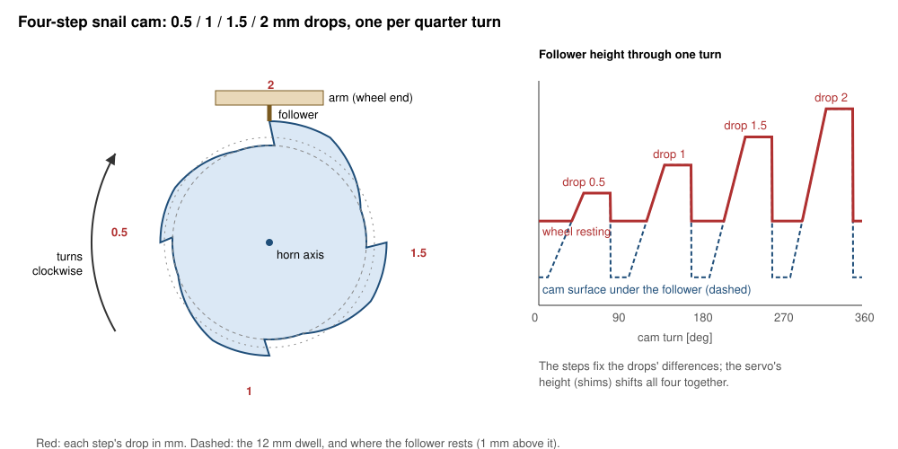
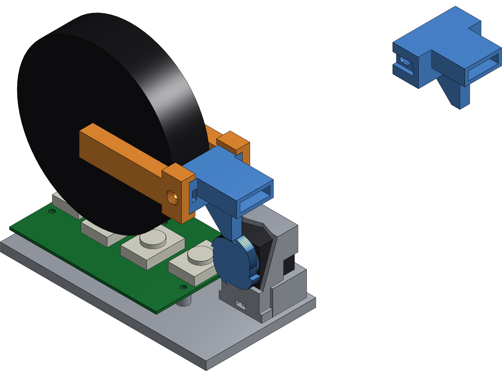

# Drop release rig: one XL330, a hinged arm, a swappable snail cam

Status: **built and run** (first run 2026-10-03: front wheel, 65 drops;
findings in `docs/status.md`, contact calibration). The arm as built:
pivot to the wheel's contact **205 mm**, pivot to the follower **124 mm**
(lever 1.65), the axle 6.5 mm above the pivot -- `config/drop_rig_bench.yaml`
`arm`, which `force_drop.py` and `analysis/drop_rig_sim.py` read. The side
view and the arm/hinge rows below are the 10-02 sketch where they differ
from the build; the hinge itself was rigged by hand. Replaces hand drops
for the contact drop test (`contact-protocol.md` §P1). The hand drops on
2026-10-02 showed what it has to fix:

| hand-drop problem | what fixed it |
|---|---|
| wheel partly supported at rest: rest force 78-93 g for a weighed 86 g | nothing touches the arm after the drop: the cam is in its dwell, clear |
| rocks and rolls on the button: 5 of 16 drops rocked or marginal | the hinge allows one arc only |
| landing squarely on a 12.2 mm button by hand (not seen to fail, but nothing ensured it) | the axle sits over the button, fixed |
| height uncontrolled, 0.3-2.9 mm | the cam's steps; `force_drop.py` still measures each one |



## Side view

```
   hinge block                clamp block          fork (lying level)
   (two bearings)  two rods   (fork's spigot)    ______________
      o==========================[#########]====|______o_______|  <- axle
      |                               |                (  wheel  )
      |                            follower            (   r50   )
   hinge post                         |                 \_______/
      |                             [cam]               [sensor]  <- button
      |                            [XL330]                           under the axle
   ===+=================================================================  base
      |<------------- d -------------->|
      |<---------------------- L ----------------------->|
```

The hinge axis is parallel to the wheel's axle, so the arm runs in the
wheel's plane like the bike frame. The fork lies level, its spigot clamped
in the block, so the axle is at the arm's height and the arm is level at
impact. The cam is under the block, at d from the hinge, not under the axle.

## Dimensions

| item | value | why |
|---|---|---|
| L, hinge axis to wheel contact | **205 mm** as built (sketch: ~200) | long, so the arc is near-vertical (2 mm drop = 0.6 deg) and the wheel's own spin inertia adds only (r/L)^2 ~ 3% to the impact mass |
| d, hinge axis to follower | **124 mm** as built (81 short of the axle) | the cam's steps reach the contact **L/d = 1.65** times larger, less a 0.13 mm offset at the follower (`arm.step_offset_mm`, fitted): the 0.5/1/1.5/2 cam drops ~0.61/1.44/2.26/3.09 mm |
| hinge axis height | **= the axle's height with the wheel resting**, adjustable +-2 mm (slotted post) | the arm is level at impact, so the contact moves straight down |
| axle height at rest | sensor seat + 8.25 mm (FS20 incl. button, datasheet) + wheel radius (front 50 mm) | measure it on the built base; the slots take up the difference |
| arm | sketch: **two parallel rods**; as built, the plastic bar friction-fit in the interface's slot (see "Parts") | stiff in twist, so the wheel cannot lean; keep them light (see "Impact mass") |
| hinge | sketch: bearings on a steel pin; as built, the bar rests on a 15 mm collar on the pivot (user) | low friction; their spacing across the arm stops the wheel leaning |
| wheel interface, front | the **clamp block**: a double-D socket like the headset upper (dia 11, 6 mm across the flats, central 6-32), its axis along the arm | reuses the fork's own spigot (`config/steering_cad.yaml` `spigot_*`); no new fork parts |
| wheel interface, rear | the same block holding the rear dropouts; the axle nut locks the wheel's roller phase | one arm for both wheels; still to design with the new dropouts |
| follower | **a small printed flat** under the clamp block, in line with the cam; face square to the arm's motion | the release is the cam's step corner passing the flat's downstream corner. On a ramp the contact sits ~5 mm off centre, hence ~6-10 mm wide. Printed corners round to ~0.45 mm, so the release still wants the cam at speed: the script holds at the start of the top flat as a run-up |
| cam | `bench/drop_cam.py`: per 90 deg segment a 20 deg bottom dwell at r 12 mm, a 40 deg ramp, a 30 deg top flat (constant radius) at 13.5 / 14 / 14.5 / 15 mm, then the step; 5 mm thick, D-bore dia 8 / 7 flat | four drops per turn, 0.5 / 1 / 1.5 / 2 mm; the top flat is the servo's run-up to speed before the edge, the bottom dwell is where it brakes and parks. Ramp pressure angles 9.6-17.7 deg |
| cam hub | boss on the XL330 horn: D-shaft dia 8 / 7 flat, 6 mm long, one M2 into the end through a washer | swap a cam with one screw; the start is set by hand each run, so no indexing |
| cam centre height | **follower resting height - 13 mm** (r_dwell 12 + gap 1) | the follower rests 1 mm above the dwell (L/d x 1 mm at the axle) |
| servo mount | fixed on the base, no shims (user, 2026-10-02) | the gap is trimmed at the axle instead; it shifts all four drops together |
| sensor | in a pocket in the base (25.1 x 17.3 mm body), button centred under the axle | the FS20 deflects 0.05 mm at 14.7 N (stiff: >= 294 N/mm) |

The XL330 horn's hole pattern is not drawn anywhere here: take it from
ROBOTIS's drawing when the hub is modelled.

## Setting the drop heights

The cam fixes the RATIOS between drops exactly (each step times L/d at the
axle); for round numbers at the axle, give `drop_cam.py --drops` the wanted
heights times d/L. Where they sit is set by the follower's height over the
cam, and that is trimmed at the AXLE (prop / shim it), not under the servo
(user, 2026-10-02): at d = L the follower 0.3 mm low gives 0.8 / 1.3 / 1.8 /
2.3 mm. Anything from just under 0.5 mm high (the 0.5 drop then vanishes)
to just under 1 mm low (the gap closes) still gives four real drops. The rear wheel's radius changes with the roller part on
the button (51.0 at the cones' big ends, 49.5 at their small ends, 51.2 at
the ridge), and every mm of it moves all four drops by a mm: re-trim per
contact, or regenerate the rear interface for it
(`wheels.rear_radius_offset`). `force_drop.py` reports the height each drop
actually had (`h_measured_mm`), so trim until the first cycle reads about
0.5 / 1 / 1.5 / 2, then leave it.

Check the gap by hand with the wheel resting: a 0.5 mm feeler under the follower,
with the cam in a dwell, should slide. No gap means the arm is partly held by
the cam and the rest force reads low again.

## Impact mass

On a hinge the mass the sensor feels at impact is the arm's inertia about
the hinge over L^2, which is not quite the resting share:

| | resting share | felt at impact |
|---|---|---|
| wheel + fork (axle above the contact) | m_w | m_w + I_w / L^2 |
| clamp block + follower, mass m_b at d | m_b d / L | m_b (d / L)^2 |
| arm (rods), mass m_a | m_a d / (2L) | m_a d^2 / (3L^2) |

(The rods taken as running hinge to block.) I_w / L^2 is at most
m_w (r / L)^2 ~ 3 g for a 60 g wheel at r 50 mm. So pass `--mass-g` = the
"felt" column summed (+ ~2 g for the wheel's spin), not the resting force.
Weigh the block, the rods and the wheel + fork before the first run.

Peak force grows with sqrt(mass): ~100 g felt at 2 mm on ~50 N/mm is ~14 N,
inside the ~19 N where the reading clips. The rear assembly is heavier: start
it with a 0.5-1.5 mm cam.

## Release speed

Printed corners round to ~0.45 mm (cam and follower together), so the
follower only free-falls if the step's edge passes faster than
sqrt(g * 0.45 mm) ~ 66 mm/s: ~280 deg/s at the 13.5 mm top radius, ~45% of
the XL330-M288's 618 deg/s no-load (estimated). Slower, it is let down over
the corner and the drop starts soft and short. With the follower at d, it
falls at about g d / L (most of the mass at the axle), so the need drops by
sqrt(d / L). As built the contact falls at 8.30 m/s^2 (fitted with m_eff on
the 10-03 run), so the follower at ~5.0 m/s^2: the need drops ~29%;
`force_drop.py --cam` keeps the d = L figure, which errs safe.

How many degrees the servo needs to get there depends on its reflected
inertia, which is not known here: bracketing it, ~2-8 deg to 45% of no-load
speed and ~4-21 deg to 65%. Hence the 30 deg top flat as the run-up, and the
park 12 deg past the step, clear of where the servo starts braking for its
goal. `force_drop.py --cam` measures it instead of trusting this: every drop
prints the edge speed as the step passes (from position reads during the
move, at 3 Mbps; a synthetic 500 deg/s trace read back as 483).

## Parts

- one base which holds the PCB with the force sensors and to which the XL330 attaches
  - force sensor PCB:
    - found in [key-holder-v5](https://cad.onshape.com/documents/ac102712f8d1c43274e5ca9a/w/98e7a679d8a4a7765bb5abd0/e/9f9e8466f192aa7d04dcac53)
    - `pcb-body`, `pcb-base`, and the `PCB` part are the actual circuit board, 5x self tap M3 screws to the base
    - `fs-arrangement` sketch shows the force sensor placements
    - not pictured: the teensy which is on tall headers; it sits at the back of the PCB and no part of the wheel can intersect it
    - ignore keyswitch holder/keycap and the weird finger guard at the front; these are not present (it's just the bare sensors)
- XL330 case halves, attaching with csk 6-32s to the base
- drop cam which simply fits onto the XL330 horn with printed pins
- interface pieces for (1) front wheel fork halves and (2) rear chainstay halves
  - follower for drop cam
  - 5.75mm tall x 19.75mm wide x ~20mm length slot for a plastic bar to be friction fit into (the lever arm)
- everything past the lever arm attach I'll rig manually

**Generated 2026-10-02:** `python -m aow_sim.cad_drop_rig`, the custom
feature `AOW drop rig` in aow-bike's `drop-rig` Part Studio (studio
`drop-rig features`), numbers in `config/drop_rig_cad.yaml`. Render:


| part | print | from |
|---|---|---|
| base | Z+ | the PCB on 5 standoffs (M3 self-tap pilots 2.5 GUESS, THROUGH so a tap can run all the way), the shells' two 6-32s from below; board outline, holes and buttons read off key-holder-v5 through the API, not measured on the board |
| back shell, cover | Y-, Y+ | the X330 fixture's IDLER shells, legs down to the base |
| cam | Y+ | `drop_cam.py`'s profile on the horn pins (no D-hub, no M2), its back face 1 mm off the cover |
| front interface | X+ | cad_steering's headset block (ledges, cheeks, two 6-32 nut slots) + bar slot + follower |
| rear interface | X+ | cad_drive's case-side joint both sides (channel, tension slot, nut slot) + bar slot + follower |

The wheel stands on button 3 (user: 2 or 3, for a compacter base; the
wheels pass 6.6 mm over button 2). The arm runs along the row toward the
board's far end, cam centre 80 mm along it, just past the board's edge.
Base 135 x 72 mm, ~69 g solid PLA. Drawn nominal: wheel resting, arm
level, the follower 26.7 mm over the button, 1 mm over the cam's dwell, so
a lift sketched off the cam reads the drop itself. Each interface carries
its own wheel's radius (front: tire OD 102.5; rear: omni outer_radius +
`wheels.rear_radius_offset`, the contact under test) and puts the follower
at that one height, so one base and one cam serve both. `--check` (one call) builds both: no interference.

- **The follower is NOT the ~10 mm centred flat above.** Parked past a
  step, a centred 10 mm flat rests on the next ramp and the step's
  corner, up to 1.85 mm over the gap (computed, `cad_drop_rig.park_clearance`):
  the arm would be held off the sensor. It runs 1 mm downstream of the cam's
  centre (that corner is the release) and 4.5 mm upstream (a flat follower's
  contact offset on the 2 mm ramp is 4.3).
- **The XL330's horn faces -Y** (its body on the +Y side), so the cam,
  turning clockwise looking at the horn as `drop_cam.py` draws it, runs
  +X under the follower. The release is the pad's square +X end; the
  45 deg chamfer that lets the interfaces print X+ is upstream, over the
  incoming ramp. Parked 12 deg past a step: 0.87 mm clear, worst segment
  (1.0 at 8-10 deg). With the chamfer downstream instead it was 0.45 at 12.
- **One bar-slot floor for both wheels:** 73.1 mm from the axle (the rear
  block sets it; the front's floor is 5.85 thick). Bottom the bar in
  either interface and the axle lands over the button and the follower
  over the cam -- the slot floor is the X reference, so push the bar home.
- **Bigger drops: not with four per turn.** A flat follower's contact
  offset on a 40 deg ramp is (gap + drop) / 0.70 rad: 7.2 mm at 4 mm, 8.6
  at 5 mm. A pad that long rests on the cam when parked (-0.14 / -0.72 mm,
  best park, with the chamfer then downstream; recheck). One 5 mm drop per
  turn (a 340 deg ramp) cleared 0.84 mm. The
  cam itself would fit: 22 mm off the tire at r 15, ~19 at r 18.
- The bar slot's centre is 3.9 mm over the axle, not on it: the housing is
  flush with the block's top. Printed X+ the slot stands open-topped.
- The rear interface's nut slots and channel ends are 2-3 mm bridges.
- Not modelled: the Teensy (position unknown here), the bar, the hinge.

## Running it

```sh
python bench/drop_cam.py                                   # the 0.5/1/1.5/2 cam -> bench/drop_cam.{svg,dxf}
python bench/force_drop.py --cam --cam-where              # once per assembly: cam.index and cam.dir
python bench/force_drop.py --wheel front --mass-g <felt> --cam --repeats 3
```

One script, one terminal: `force_drop.py` fires each drop itself, so each
one is labelled by the step that released it. The cam sits on the horn
pins in one position, so `Present Position mod 4096` is its angle;
`--cam-where` prints it, torque off, while the cam is turned by hand: the
reading as the first drop releases the follower is `cam.index`. That, the
direction, the U2D2's port (default: the one `usbserial` present), the
servo's ID, the cam's drops and the current live in
`config/drop_rig_bench.yaml`; each has a flag to override it.
Current-based position mode with one Goal Current (300 mA) written with
every move, and every move FORWARD: per step a setpoint on its top flat
(`--margin-deg` 30 short of the step, the run-up) and one in the dwell
(`--park-deg` 12 past it). Backward would drive the follower into a step's
undercut. It starts wherever the cam is, drives forward to the next top
flat (a drop on the way is not recorded) and zeroes there with the wheel
lifted. On any exit it goes forward to the next dwell, then torque off.
Profile Velocity is not used: ROBOTIS applies it in (extended) position
mode only. First run on the rig 2026-10-03 (front wheel, 65 drops,
`bench/logs/drops_20261003-2224_summary.csv`).

The XL330 is 5 V: its own supply through the U2D2, never the 12 V chain
(`untethered-setup.md`).

## AHRS mode: a wave cam, no drops

Added 2026-10-06, drawn, nothing printed. The user's aim is the TM151's DYNAMIC
response, which the AHRS fixture could not separate: its tau rose with
vibration above ~2 Hz or with rotation, and that rig "cannot give one
without the other" (`ahrs-fixture.md`). Here the cam shakes the arm at a
known frequency with the wheel held clear of the sensor, so nothing drops.

- **Force sensor: not used.** The wheel never touches it in this mode; the
  truth is the still holds. So no new interface either.
- **Follower tip** (CAD, `follower tip`, prints Y+): a jam-on cap over
  either interface's follower pad, located by the pad's downstream face and
  its 45 deg chamfer, fit 0.05 mm a side (GUESS: jam, or glue). A 0.8 mm
  plate under the pad and a rounded nose 0.9 wide (user) hanging 1.5 below
  it, centred over the cam: the nose's bottom is 2.3 mm under the old pad.
  Walls 6 mm up the pad. The nose runs square-ended from the -Y face (the
  bed, printed on its side) to 0.1 mm past the cam's +Y face, short of the
  servo cover; the plate clears the cover by 0.35 mm with the wheel RESTING,
  so the tip clears the rig with or without the cam holding it up.
  The flat pad itself cannot ride a wave: it bridges the valleys.
- **The cam kit** (CAD, `wave cam <name>`, each prints Y+, ~15 min;
  `config/drop_rig_cad.yaml` `wave_kit`; `drop_cam.py --tones` draws any of
  them and prints its table). Each cam is a sum of tones -- N lobes per turn,
  a peak-to-peak height at the follower -- on the same horn pins, never under
  0.7 mm above the nose's resting height (the wheel ~0.9 mm clear, after the
  0.13 offset). Numbers at 1 rev/s, at the follower (x1.65 at the contact),
  computed:

  | cam | asks | Hz | acc pk | arm rate pk |
  |---|---|---|---|---|
  | blank | the control: servo and gears turn, the arm does not | -- | -- | -- |
  | 1x3.0 | rotation with little acceleration | 1 | 6 mg | 4.4 deg/s |
  | 4x2.4 / 8x0.6 / 16x0.15 / 32x0.04 | frequency at EQUAL acceleration, the rotation halving each step | 4 / 8 / 16 / 32 | 77-82 mg | 14 / 7 / 3.5 / 1.9 deg/s |
  | 8x0.3 / 8x0.6 / 8x1.0 | acceleration level at one frequency | 8 | 39 / 77 / 129 mg | 3.5 / 7 / 11.6 deg/s |
  | 3x1.0, 13x0.2, then both | superposition: does tau answer the high band or the total? | 3 + 13 | 86 mg (both) | 8 deg/s |

  Acceleration grows with the speed squared, rotation with the speed: the
  servo reaches 1.72 rev/s (618 deg/s no-load), and every cam's follower
  stays on past that (closest: 8x1.0, which would leave at ~2.0 rev/s; the
  equal-acceleration set at ~2.5). 32x0.04 is under print accuracy: the AHRS's own
  accelerometer reads the amplitude it really got, which is the input that
  matters anyway. No room to engrave a name (the horn collar fills the face
  to r 10): mark each with a pen as it comes off the printer.
  `--check` (2026-10-06, both wheels, all 11 cams and the tip): no
  interference, no downward faces on any cam; the plate clears every cam
  by >= 0.76 mm away from the nose.
- **The hinge's arc** (computed 2026-10-06): the nose sits ~20 mm below the
  pivot's height (pivot 6.5 under the axle, `drop_rig_bench.yaml` `arm`), 125
  mm from it, so it rises along a line 9.25 deg off vertical, not radially.
  The cams are drawn for a radial follower; on the arc the nose drifts along
  the cam by lift x 0.16 (<= 0.6 mm), a near-constant phase shift, and every
  pressure angle gains ~9 deg on one flank: worst 4x2.4 at 29.5 and 8x1.0 at
  27.2, against ~30. If one sticks or chatters, it is 4x2.4 first. The plate
  still clears every cam by >= 0.82 mm on the arc.
- **Vibration vs rotation:** the arm turns at one rate along its length,
  ~0.2 deg amplitude, ~12 deg/s peak at 10 Hz; acceleration grows with
  distance from the pivot. Run the AHRS near the pivot, then near the axle:
  the difference is the acceleration's.
- **Truth:** still holds, servo stopped, before and after each speed; hold
  each speed >= 10 s (tau ~1 s moving).
- **Hookup:** the AHRS, the U2D2 and the force sensor all go on the Pi
  (user), so one host clock: `force_drop.py --ahrs --ahrs-at-mm X,Z`
  (10-07) logs every TM151 frame and every servo read on `perf_counter`,
  and each drop row carries `t_zero_host_s`. Ports by USB vendor (Teensy
  16c0, TM151 0483), each checked by what it sends. Wave mode (no drops)
  has no driver yet.

## Next

- ~~Generate the parts that have to fit existing geometry~~: done
  2026-10-02, see "Parts". Roller phase: locked with the axle nut (user).
- Print and check: the M3 pilots, the fork and chainstay joints in their
  new blocks, the bar's friction fit, the follower's parked gap with a
  feeler.
- ~~Hinge and arm~~: built by the user (2026-10-03), contact 205 mm and
  follower 124 mm from the pivot (`drop_rig_bench.yaml` `arm`).
- **First AHRS run: the existing drop cam** (user, 2026-10-06), the TM151
  on the bar, at several stations (record each one's distance from the
  pivot and height above it). Ramps give slow known rotation, the drops
  known shocks (force sensor), top flat and dwell the still holds -- which
  need `force_drop.py --hold-s 3 --settle-s 3`, not the contact test's
  0.5 / 0.3. Before it, the force sensor epoxied down under weights (user).
  Logger written 10-07 (`--ahrs`, above). **Run 20261007-1219** (Pi,
  `--dry-run --ahrs`: the Pi reboot-loops with the force sensor on it
  too, user), the TM151 at 115 mm from the pivot, 22 mm above: 12 drops,
  15505 frames, 0 CRC failures. Gyro-integrated step within ~0.07 deg of
  (h - 0.13)/124 rad; the pitch reading settles by 0.5 s after release.
  The arm turns ~-0.09 deg (against the drop) in each 115 ms run-up, every
  drop: a top flat that rises, or the rig tilting -- not yet known. The
  TM151's clock runs 0.30% fast against the Pi's, and the first frame of a
  run is stale (8.4 s old). **Run 20261007-1228**, the TM151 on the fork
  at 190 mm, ~25 outboard, bar height, less secure (user): every pitch
  step ~0.08 deg smaller than on the bar (0.05 / 0.33 / 0.53 / 0.74 against
  0.12 / 0.41 / 0.63 / 0.80), peak roll rate 2-3x (34-58 against 15-20
  deg/s); still-hold noise the same, 0.28 deg/s. A rigid arm turns alike
  everywhere, so the fork moves on the bar: twist, or flex between hanging
  and resting on the wheel. **Run 20261007-1237**, on the bar at 25 mm
  (mounted turned 180 deg: signs flip): each 0.5 mm still ~0.23 deg, but
  every step +0.32 deg over the cam's (115 mm: -0.03, fork: -0.11), peak
  pitch rate higher than at 115 (51-91 against 36-65 deg/s), roll 5 deg/s
  against 15-20 and 34-58. **The arm is not rigid**: a bend that moves with
  the load (follower -> wheel), and a twist growing toward the wheel. So
  stations do not share a rotation, and "the difference between stations
  is the acceleration's" (Vibration vs rotation, above) does not hold here:
  each station's truth has to be its own. The run-up rise is ~0.08-0.10
  deg at all of them. **Run 20261007-1246**, bar at 70 mm: +0.19 deg over
  the cam, roll 8-11 deg/s -- between 25 and 115 on both, so the offset
  falls and the twist grows steadily along the arm (+0.32 / +0.19 / -0.03
  / -0.11 deg at 25 / 70 / 115 / 190; per 0.5 mm 0.23-0.25 deg at every
  station). The offsets are ~0.2 mm at the follower, inside the rig's
  tolerances (user). **Repeats**: 70 mm untouched (1252) +0.19 again, each
  drop within ~0.02 deg; 115 mm after three re-mounts (1255) -0.05 against
  -0.03. So the offsets are the station's, not the rig shifting between
  runs: the arm's angle changes unevenly along it as the load moves from
  the follower to the wheel (a bend, or play at a joint -- not separated).
  A fixed tilt (the bar's flatness, the mount) cancels in a step: it is
  the absolute pitch, 0.4-1.1 deg across the stations.
- **The filter against the drops** (10-07, a scratch script, not yet in
  `analysis/`): truth = the TM151's own gyro integrated from each still
  hold. The fused pitch's error is 0.13-0.29 deg peak, ~0.05 RMS, and does
  NOT grow along the arm (25 mm: 0.29 / 0.07; 190: 0.17 / 0.04), while the
  accelerometer's own tilt error in the 0.3 s after release grows 16 -> 37-43
  deg RMS. `sim_ahrs.run_tilt_filter` on the same gyro and accelerometer
  predicts 2.6-4.3 deg peak, ~1 RMS: 15-25x too much. Adding the unmeasured
  `FILTER_ACC_GATE` (skip |acc| further than gate from 1 g), model against
  the fused output, RMS deg:

  | gate | 25 mm | 70 | 70 | 115 | 115 | 190 |
  |---|---|---|---|---|---|---|
  | none | 0.65 | 1.02 | 1.05 | 0.72 | 0.73 | 1.21 |
  | 0.2 g | 0.19 | 0.22 | 0.25 | 0.09 | 0.12 | 0.05 |
  | 0.05 g | 0.08 | 0.06 | 0.12 | 0.04 | 0.04 | 0.04 |
  | 0.02 g | 0.04 | 0.04 | 0.08 | 0.04 | 0.04 | 0.04 |

  So the part rejects SHOCK (|acc| off 1 g) and the lever arm does not
  reach its output here. What this rig cannot test: a sustained lever-arm
  or turning acceleration barely moves |acc| (0.1 g sideways: +0.005 g)
  and passes any such gate. One unit.

  **Against the fixture** (the same gated filter, `filter-model`'s metric,
  moving RMS deg; the ungated rows reproduce the published fits):

  | gate | upright, repeat | upright | flipped | drops (6 runs) |
  |---|---|---|---|---|
  | none | 0.103 | 0.088 | 0.195 | 0.65-1.21 |
  | 0.2 g | 0.104 | 0.088 | 0.193 | 0.05-0.25 |
  | 0.1 g | 0.104 | 0.094 | 0.181 | 0.05-0.17 |
  | 0.05 g | 0.148 | 0.154 | 0.194 | 0.04-0.12 |
  | 0.02 g | 0.275 | 0.275 | 0.405 | 0.04-0.08 |

  No one magnitude gate fits both: the fixture's moving |acc| sits 11 mg
  off 1 g at p50, 74 at p99, and the part keeps using it, which a gate under
  ~0.1 g forbids. **0.1 g** leaves the fixture as fitted and takes the drops
  from ~1 deg to 0.05-0.17, about the fixture's own level -- a defensible
  setting, not the part's mechanism (whatever that is also sees the shock's
  size or length). Not set in `sim_ahrs` yet.

  **Adaptive instead of a gate** (10-07, scratch `adaptive_fit.py`, numba;
  matches `run_tilt_filter` exactly with it off): the accelerometer's pull
  scaled by 1 / (1 + (m/d0)^2), m = |acc|'s distance from 1 g, held with a
  decay h. Grid d0 0.01-0.2 g x h 0-0.5 s; fitted on fixture upright x2 +
  drops 1219/1246/1228, checked on fixture flipped + drops 1255/1252/1237.
  Model against the fused output, RMS deg:

  | | fix up | fix up | drops (fit) | fix flipped | drops (check) |
  |---|---|---|---|---|---|
  | current model | 0.103 | 0.088 | 0.72-1.21 | 0.195 | 0.65-1.05 |
  | hard gate 0.1 g | 0.104 | 0.094 | 0.06-0.17 | 0.181 | 0.07-0.14 |
  | **d0 0.12 g, h 0.1 s** | 0.102 | 0.095 | 0.025-0.032 | 0.148 | 0.023-0.086 |
  | d0 0.08 g, h 0.1 s | 0.113 | 0.108 | 0.017-0.021 | 0.143 | 0.018-0.041 |

  Both interior to the grid; the check sets hold up, the 25 mm run (1237)
  worst. d0 0.12 / h 0.1 keeps the fixture and takes the drops to ~0.03.
  **Set in `sim_ahrs`** (`FILTER_ACC_D0_G`, `FILTER_ACC_HOLD_S`). Eval grid
  (`general_rl_cmd_curriculum2b`, `tm151_filter`, one process per mode):

  | | fell /20 | hold tilt err p50 / p95 | all commands p50 |
  |---|---|---|---|
  | truth | 0 | -- | -- |
  | `tm151` (noise) | 2 | 2.0 / 3.8 deg | 1.8 |
  | filter, unweighted | 19 | 8.6 / 14.6 | 8.2 |
  | hard gate 0.1 g | 7 | 2.6 / 4.5 | 3.4 |
  | adaptive | 1 | 0.7 / 1.7 | 2.1 |

  The worst left is crabbing (v_lat 0.4), 5.4-5.8 deg: sustained sideways
  acceleration, the one case neither rig has measured. One unit, two
  parameters. Power: the XL330 runs from its own 5 V brick (user);
  throttled=0x0 over a whole AHRS + U2D2 run, and the Pi still restarted
  between runs twice, once into a loop (U2D2 LED cycling with it).
- The wave kit and the tip: drawn, not printed. **Print 4x2.4 and 8x0.6
  with the tip** (10-07): 4x2.4 alone sweeps 1-7 Hz, up to ~230 mg at the
  follower and 3.5-24 deg/s of arm rate by servo speed (across the filter
  model's 1-15 deg/s tau band); 8x0.6 has the same acceleration per rev/s
  at twice the Hz and half the rate, so the pair separates frequency from
  rotation. 4x2.4 is ~29.5 deg pressure angle on the arc: 8x0.6 is the
  fallback. Mount the TM151 HIGH near the pivot (a stiff riser, chip ~60-80
  mm above it): horizontal acceleration is alpha x height, independent of
  the distance along the bar, and it is the part that tilts the gravity
  reading without moving |acc|. Control: the usual 115 mm / 22 mm mount.
  Driver: `bench/wave_run.py` (10-07), velocity mode -- Profile Velocity
  does not hold a speed in current-based position (user) -- with a speed
  check that stops it (Current Limit does nothing in velocity mode); the
  servo's own velocity gains; fake-servo tests only, not yet run on the rig. Big logs (AHRS,
  servo, ~3.5 MB a run) go to `bench/logs/archive/`, gitignored and
  Dropbox-synced; the summaries and `_run.json` stay tracked.

## Open

- The sensor board's layout and how the base clamps to it: not known here.
- The fork lies level, so at impact its legs bend where on the bike they
  are loaded mostly along their length. Any bend is in series with the tire
  and reads as a softer contact. Not measured: check with the dial on the
  axle vs on the clamp block under a weight, before trusting a sink.
- Whether the real wheel's bounce depends on mass (the sim's front does not,
  its rear does): bolt weights to the wheel end and repeat.
- First run: does the follower leave the step cleanly? A slow release shows
  up as `h_measured` short of the cam's step (by up to the ~0.45 mm corner
  rounding) and a softer rise in the trace. If so, a longer run-up
  (`--margin-deg`) or a crisper corner.
