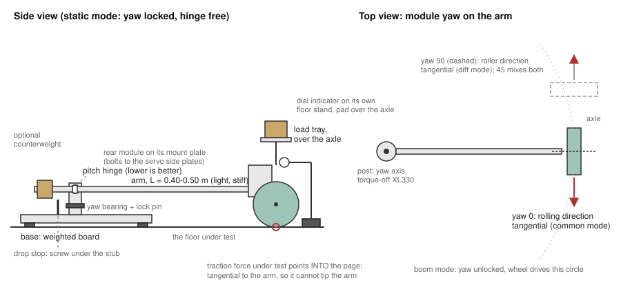

# Pre-assembly bench — rig ideas and proposed experiments (draft)

> **Status: DRAFT, 2026-09-24/25. Brainstorm record and a proposal; nothing
> here is built, run or decided.** It does NOT replace the existing protocols:
> `contact-protocol.md`, `floors-and-the-contact-model.md` and
> `first-physical-test.md` still own the procedures until something here is
> tried on hardware and holds up.
>
> What it holds:
> - **Proposed experiment designs**, written against the FIRST rig concept (a
>   hinged floor arm), which has since changed several times. The idea
>   most likely to survive is measuring per-floor friction from the drive's
>   traction limit rather than an incline, since a floor cannot tilt. It is
>   still untested.
> - **The rig design log** ("Open", further down), in the order the ideas came
>   up. The latest state lives in MuJoCo (`aow_sim.floor_rig`), and the rig
>   design waits on what can actually be built and on physical gantry tests.
> - **The planning notes**, kept verbatim at the end.
>
> Numbers marked *computed* come from the model, the datasheet or tooth
> counts. None of them is measured.

---

## Design rules

These follow from the constraints raised in planning.

1. **A per-floor test runs on the floor as it lies.** Nothing tilts and
   nothing is carried to a bench. That rules out the incline test (P0b).
   Friction comes from the drive's own traction limit instead (F3), which also
   separates the rolling and lateral directions the incline mixed.
2. **The rear module is fixtured once.** Clamped at a table edge, the floor
   arm is the drive bench with the wheel in the air. On the floor it holds the
   wheel at a known load. Same mount plate for every test.
3. **Sensing is the bus.** `bench_log` records duty, supply voltage and
   positions. The only extra rotation sensor is a torque-off XL330. A dial
   indicator reads static displacement. The 240 fps phone is used only where no
   encoder can see the motion: drop rebounds and roller return.
4. **Force comes from masses and a scale**, never from a servo register.
   - XC330 `Present Current` is uncalibrated (that is R6).
   - XC430 `Present Load` is computed from PWM and speed.
5. **Take the data before the fitting tools exist.** Every floor test records
   raw readings. The fits can come later, and a floor visited once shouldn't
   need revisiting because a script was missing.
6. **Order by prerequisite**, not by how cheap a test is.

---

## The rig set

### Rig 1 — the floor arm

A light arm hinged at a post, with the rear module at its end and the wheel on
the floor. The hinge is the wheel's only vertical freedom. Weights on a tray
directly over the axle go entirely into the wheel (moments about the hinge).
The post turns on a yaw bearing:
- **Locked:** the arm holds the wheel in place for static, drop and traction
  tests.
- **Free:** the wheel drives the arm round a circle, which is the "dyno" from
  planning.

| part | spec | why |
|---|---|---|
| base | the 7" (178 mm) round plate screwed to a board, three rubber feet at the board's corners, weight on the board | the anchor. Three feet don't rock on an uneven floor. It has to resist F3's yaw torque, F·L: the worst case is 16 N × μ 1.5 = 24 N at the contact, so ~10.8 N·m at L = 0.45 m and ~4.8 N·m at 0.20 m (computed). Feet at radius r_f with friction μ_f hold W·μ_f·r_f, so W ≳ F·L / (μ_f·r_f): ~11 kg at L = 0.45 m or ~5 kg at 0.20 m, taking μ_f 0.5 and r_f 0.2 m. A wider board helps as much as more weight |
| post + yaw bearing | vertical shaft in two ball bearings; lock pin through a ring of holes; a **torque-off XL330** coupled directly to the shaft | locked for F1–F3, free for F4–F6. The XL330 reads yaw on the same bus |
| hinge | horizontal axis perpendicular to the arm, two ball bearings, a lock pin | **as close to floor level as the base allows.** The sketch shows it at axle height; see "Open: pivot at the virtual front contact" for why lower is better |
| arm | light and stiff (aluminium box section or twin tubes); **L = 0.40–0.50 m** hinge to axle, measured to 1 mm | long enough that path curvature is negligible across the 33 mm-wide wheel (Ø102) |
| counterweight | *optional*: a stub behind the hinge | only if C2 reads the lightest load above ~5 N. The module is probably ~3–4 N on the wheel: two XC430s at 65 g (datasheet), wheel ~115 g (measured parts), plus plates, pulleys and belts, which are unweighed. That is already under the sim's 5.5 N in-use share. Not needed for table mode, which locks the hinge |
| module mount | plate at the arm end that bolts to the rear drivetrain's servo side plates (Onshape `aow-bike`, tab `aow-bike`); hole sets for yaw 0°, 45° and 90° | the one fixture. **Design it to take the front fork too**, for the front tire tests |
| load tray | on the mount, directly above the axle | added weight loads the wheel only |
| drop stop | an adjustable stop under the arm end, or a spacer block | a repeatable drop height h0, set with a ruler or a stack of blocks, not with the dial |
| dial indicator | **0–10 mm travel, 0.01 mm graduations**, on its **own stand on the floor** 100–150 mm from the wheel, plunger on a flat pad on the mount directly above the axle | reads axle height against the floor near the wheel, independent of the arm. Range: F1 on hard floors should stay under ~2 mm at 44 N (computed 1.95 mm at the shipped contact; the 08-08 hand check said ~1 mm), so 10 mm leaves room for soft floors and preload. A thick rug may need 25 mm, or stop F1 short of 44 N there. Resolution: 0.01 mm is needed for C4's 0.02 mm and for separating 1 mm from 2 mm |
| table clamps | two C-clamps | table mode |

**Modes.**

| mode | yaw | hinge | where | used by |
|---|---|---|---|---|
| table | locked | locked | base clamped at a table edge, module beyond the edge, wheel in the air | E1–E4 |
| static | locked | free | on the floor | F1, F2, F3 |
| boom | free | free | on the floor | F4, F5, F6 |

**Two geometry rules, both from the hinge.**

- **The force under test is always tangential to the arm.** The hinge is at
  axle height, and the contact is a wheel radius below it. A traction force
  *along* the arm therefore tips the arm and changes the normal load by about
  F·R/L: ~11 % of F at L = 0.45 m (computed). A tangential force loads the
  hinge bearings instead of N. So:
  - rolling-direction tests at yaw 0° (axle along the arm);
  - lateral (roller) tests at yaw 90°;
  - 45° only in boom mode, and with that caveat noted.
- **The dial must not ride on the arm.** Its stand sits on the floor beside
  the wheel. On a soft floor the stand sinks by a fixed amount, which cancels,
  because the added weights go on the tray and never on the stand.

### Open: pivot at the virtual front contact (user, 2026-09-25)

**The idea.** Put the arm's pivot where the front wheel's contact would be,
at floor level, so the rig moves the rear module the way the bike moves
about its front contact. That gives three rotations:

- yaw about the vertical;
- pitch about a horizontal axis at floor level (the load hinge);
- roll about the line from the pivot to the rear contact, which is the
  bike's own roll axis.

Worked through against the tests above:

- **Pitch at floor level is better for F3.** With the hinge at contact
  height, a traction force along the arm passes through the hinge axis and
  can't change N. The "force tangential to the arm" rule then goes away,
  leaving only the residual (hinge height − contact height)·F/L. The base
  plate's thickness sets how close that gets.
- **L becomes the wheelbase, 0.20 m** (`bike_params` `wheelbase`, `source:
  design`), against 0.40–0.50 m in the sketch. Costs:
  - the boom circle is tight: the 33 mm wheel spans about ±4.7° of arc;
  - a 35 mm drop pitches the arm ~10°;
  - F4's radius error doubles (±0.13 mm at ±0.5 mm on L_c).
  - Gain: the base torque halves.
  - For F1 and F3, which are static, L barely matters. For F5 the tight
    circle is arguably right, since it is the bike's pivot move.
- **Roll stays locked for every pre-assembly test.** The module stays
  upright. Roll free is the later "first balance attempt" mode.
  - One way to get all three rotations: a rod end (spherical plain bearing)
    at floor level, bolt vertical, locked in roll and pitch by removable
    struts.
  - Cost: its plain-bearing friction and play land in C4 (hinge hysteresis)
    and C7 (yaw drag), which would show whether it is acceptable.
  - The alternative is separate ball-bearing axes (yaw, then pitch, then
    roll), which is more parts.
- **A slide along the arm** (two round rails, sleeve bearings) can mean two
  things:
  - **Adjustable L, clamped during a test.** Cheap, no downside. Re-read C2
    at each position, because the load table depends on L.
  - **A free radial freedom**, so the wheel can move along the arm as well as
    round it. Then sleeve friction acts on every boom test. Plain bearings
    on steel run roughly μ 0.1–0.3 (a rough figure, not measured here), times
    a load of 4–20 N, which is comparable to the traction being measured.
  - Plain linear bearings also bind when the driving force acts too far from
    them. The usual guideline is to keep that distance under about twice the
    bearing's length (the "2:1 rule"). Here the force acts at the contact,
    below the rails.
  - As a clamped adjustment it is fine. As a free freedom it needs its own
    commissioning step, like C7.
- **Leaning (user, 2026-09-25): a wide board with the pivot hanging off its
  front edge, and a 180° workspace in front of it.**
  - **Pivot height:** the pitch bearings mount on the board's front edge
    rather than on top of it, so the axis sits a bearing radius plus
    clearance above the floor, not a board thickness plus a housing.
  - **Lever arms over the exact axis:** it doesn't have to reach the floor.
    What matters is *knowing* the pivot height h_p above the floor and L. A
    force F along the arm at the contact then shifts the load by
    ΔN = ±F·h_p/L, which can be corrected exactly (see F3). Running both
    directions cancels it to first order anyway.
  - At h_p ~15 mm and L 0.20 m, ΔN is ~7.5 % of F each way, and what survives
    the averaging is ~0.6 % at μ 1 (computed). With the hinge at axle
    height (h_p = R = 51 mm), it was 26 % and ~6.5 % at L 0.20 m.
  - **180° instead of full circles:**
    - the board sits entirely behind the pivot, which makes it easy to
      weight;
    - the arm needs soft end stops at ±90° against the board edge.
  - Cables are not a reason either way. The drive servos ride on the module,
    and with the Pi and pack aboard nothing crosses the yaw joint except the
    yaw XL330's lead, which sits on the axis. A tethered U2D2 would twist
    one turn per lap, which is untwisted between runs.
  - What 180° gives up is continuous circling, and no test needs it. F5's
    reversals barely travel, F6's slide is ~120 mm, and F4 runs back and
    forth.
- **Candidate pivot hardware (user, 2026-09-25): a Markins Q-Ball ball head
  (M10/M20)** the user already owns. Per its product sheet: 40/45 kg rated,
  Ø44/48 mm ball, a panning base with its own lock and a degree index, and an
  Arca-Swiss quick-release clamp.
  - **How it would be used (user): panorama mode.** Lock the ball; the pan
    base is then the one free axis, with its own lock. The head's
    orientation picks which axis that is.
    - Pan axis **vertical** → yaw, and the index gives the 0°/45°/90° steps.
    - Pan axis **horizontal**, perpendicular to the arm → the pitch hinge,
      with the pan lock as the hinge lock.
  - **Friction is a measurement, not a verdict.** The dial sets it from high
    to low, and at its lowest the ball feels about the same as the pan axis
    (user). The pan drag is what matters in panorama mode, and it is
    unmeasured. As pitch it has to pass C4 (repeat within 0.02 mm); as yaw
    it becomes C7's load on every boom test.
  - **One head covers one axis per setup.**
    - Static mode (F1–F3) needs only pitch, so the head alone does it.
      On its side, the pan axis runs through the base's centre, so h_p is
      about the housing radius (31/34 mm) plus whatever it stands on
      (estimated from the sheet's Ø62/68 mm, not measured). F3's
      per-direction correction handles that exactly.
    - Boom mode (F4–F6) needs yaw and pitch free together, so it needs a
      second joint beside the head: a yaw turntable under a sideways head,
      or a pitch hinge on the clamp of an upright or inverted head. Either
      way, h_p is set by how that stack meets the floor.
  - **Not upright on top of the board with a hinge on its clamp:** that puts
    the pitch axis ~100 mm up (the head is 98–101 mm tall), and (μ·h_p/L)²
    is no longer small at L 0.20 m.
  - **The Arca clamp** is a quick attach for whatever hangs from it. It is
    not an L adjustment when the arm pivots on a hinge below it; L adjusts
    along the arm.
  - **Yaw encoder:** there's no shaft for the XL330, so if the head is the
    yaw axis, the XL330 couples to the rotating housing (Ø62/68 mm) some
    other way.
- **Current layout (user, 2026-09-25): pan-tilt head, sliding rod,
  "eggbeater".** Drawn in `aow-bike-rig` around the real bike parts (see
  Tooling); an interference check found no clash.
  - A pan-tilt head gives yaw and pitch, each with its own lock.
  - A square rod slides in sleeves on the tilt platform, fore and aft.
  - The rod drops to a roll housing near the floor. The bike rolls about the
    end of the rod; the rod itself never rolls.
  - A U-frame round both wheels carries the drivetrain. Its roll shaft sits
    on the line through both contacts.
  - **The bike faces along the rod, so the module never needs turning 90°.**
    - Rolling direction = along the rod: the slide (clamped for F3, free for
      F4 and F5).
    - Lateral = across the rod: yaw.
  - **Superseded the same day: the tilt hinge became a parallelogram.**
    Two level links between a post on the yaw member and a post carrying
    the bike. The bike end only translates vertically, so traction forces
    and their moments do no work along the load freedom and cannot shift N,
    at any height. What remains goes as tan(link angle): keep the links
    level at the working load. The hinge-height correction in F3 then drops
    to a check. The yaw bearing hangs from an overhang, so everything that
    yaws clears everything fixed. The head is custom (user: scavenge or build
    one); the drawing is that custom version.
  - **Dial indicator: left out of the drawing** until the one on hand is
    known (user).
  - **Sensing.**
    - Heading comes from the TM151: magnetometer for a resettable heading per
      setup, gyro for short motions. No yaw encoder. Use non-magnetic ballast
      and keep the TM151 away from the XC430s' magnets. Its yaw accuracy
      here is unmeasured.
    - What still needs an encoder is slide travel (F4, and F5 in the rolling
      direction). That is where a torque-off XL330 fits, as a string encoder,
      or the phone.
  - **L range.**
    - The rod gives 400–800 mm (2–4 wheelbases) with the front wheel mock in
      place.
    - The drivetrain clamps also slide along the U-frame rails. Without the
      front wheel they can come forward ~130 mm, to L ≈ 270 (computed from
      the drive parts' reach, y ≤ 123, against the frame front at y 256).
    - L = one wheelbase would need a shorter frame front, which the front
      wheel occupies.
  - **Fixed positions or a slide:** a rod in sleeves with a clamp screw gives
    both, so fixed holes are only simpler if there is no slide at all.
- **Next layout under discussion (user, 2026-09-25): yaw arm → pitch → roll.**
  One stiff yaw axis, with a light arm that is stiff in yaw **and pitch**.
  At the arm's end, the pitch and roll joints move with the bike gantry, so
  the slide sits between the arm and the pitch joint. Chain: yaw → slide →
  pitch → roll → gantry.
  - **Roll:** a free ball-bearing eggbeater on the floor-level line through
    both contacts. No servo; the TM151 reads roll. Only the axis *line*
    matters for a revolute joint, so the bearing can sit ahead of the front
    contact.
  - **Pitch:** axis roughly at the front axle (50 mm up, one wheelbase from
    the rear contact), with an XC330.
    - The servo sits on the non-rolling side, so roll stays light and free.
    - Pitch-axis height h sets traction load transfer, ΔN = F·h/L. The real
      bike's is F·h_cg/wheelbase, with h_cg ≈ 124 mm in sim (computed, with
      the `GUESS` chassis mass). A pivot at the front axle gives ~40 % of
      the bike's transfer; at CoM height it matches; a parallelogram gives
      zero, which is cleanest for identification (F3).
  - **The XC330 as "weight":** 0.80 N·m stall (datasheet) at L 0.20 m is at
    most ~4 N at the rear contact. That's enough to modulate around the
    in-use 5.5 N, not to replace F1's masses (up to 44 N).
    - Its torque scale needs R6 or an E1-style string-and-mass calibration.
    - The arm must be stiff in pitch so the torque becomes wheel load rather
      than arm deflection.
    - Its gearbox drag makes pitch un-free for drops (F2) unless it can be
      decoupled.
- **Revised same day (user):**
  - **Both XC330s ride on the rolling side, like every other servo.** Chain
    becomes yaw → slide → roll → pitch → gantry. The roll servo's body is on
    the roll member, horn to the slide side; the pitch servo's body is on the
    gantry, horn to the roll member. Only the pitch joint's small angle is
    crossed by a cable.
  - **Both axes instrumented by default, each decouplable** (a pulled pin at
    the horn) when an experiment needs it free.
  - A back-driven geared servo adds two different things:
    - reflected rotor inertia (the gear ratio squared times the rotor's);
    - gearbox friction, i.e. stiction.
  - Where the friction bites:
    - In pitch, stiction τ_f is a ±τ_f/L band on the rear load and damps
      drop rebounds (F1, F2).
    - In roll, it resists falling, which the real bike never feels.
    - Both drags are unmeasured; measure them the C4/C7 way.
  - **Pitch axis to reproduce the bike's traction load transfer:** h_p/L_p =
    h_cg/wheelbase. At L_p = wheelbase that means h_p = h_cg, i.e. the
    front-axle station raised to CoM height. Sim h_cg ≈ 124 mm (computed,
    `GUESS` chassis mass); re-derive once the bike is weighed.
- **Removable instrumentation (user, 2026-09-25):**
  - Each joint's real shaft ends in a keyway slot. An adapter on the XC330
    horn pattern carries the matching key. The servo slides in
    perpendicular to the shaft into a fixture on the member that holds that
    shaft's bearings.
  - **Why slot and key, not spline:**
    - It engages radially, so the servo drops in from the side; a spline
      needs axial insertion.
    - It floats along the slot. The servo's output bearing plus the joint's
      own bearings would otherwise over-constrain one axis, so that float is
      wanted. It is rigid across the slot, so the fixture must be accurate
      in that direction; a full Oldham (two crossed slots) floats both.
    - It only engages at the joint's zero (or 180°) pose, which gives a
      repeatable encoder zero.
  - **Cost: backlash from slot clearance.** Play ≈ clearance ÷ half the key
    length: 0.1 mm on a 12 mm key is ~1°, 0.05 mm on a 20 mm key ~0.3°
    (computed). That is a deadband at every reversal, large next to the
    encoder's 0.088°. Fix it with a long key, a tight or preloaded fit, or a
    metal key in the print.
  - **Which member carries the servo body:** the one holding the shaft's
    bearings. For "servos ride the rolling side", the roll joint wants a
    dead shaft fixed to the non-rolling side, with the bearings in the
    rolling member.
- **Axial preload (user):** a flat key gains nothing from axial pressure.
  - **V-flanked key and slot** plus an axial spring remove the play, with the
    servo floating in x/y (not about the axis) so the taper centres it.
  - Spring force must exceed (τ/r)·tan(flank). At 0.8 N·m stall and
    r = 10 mm that is ~46 N at 30°, ~21 N at 15° (computed); too shallow
    self-locks.
  - The preload also pushes along the servo's output bearing (its axial
    limit is unchecked) and adds friction in the joint's own bearings.
- **Correction (user): the axial pressure is for RETENTION.**
  - The adapter sits on long pins in the horn's holes, with a blade in the
    shaft-end slot, and nothing else holds it. It is a screwdriver bit: the
    horn and the shaft end sandwich it.
  - So use **parallel-sided** blade and slot. They don't cam out, so a light
    spring only has to keep the adapter seated. The V-flank idea above is
    only for zero backlash, and it buys that with the cam-out force.
  - Backlash then comes from clearance, per the numbers above.
  - The pins must stay engaged over the servo's axial float. If the servo
    fixture can't float sideways, a slot on the horn side too, crossed at
    90° (an Oldham coupling), takes misalignment both ways.
- **Drawn 2026-09-25 (best estimate):** yaw → arm → slide → roll (dead shaft
  on the carriage) → pitch (dead shafts in the roll yoke at y = 200, height
  124 mm) → gantry, with keyed XC330s on the rolling side. Clash check clean
  (41 rig bodies against 36 bike bodies; only the drive clamps touch the
  cases). The drawing's header gives the colour key.
- **Redrawn again (user): low yaw, and the yaw bar is the variable part.**
  - The base is the 7" round plate plus non-magnetic ballast. It's round,
    so nothing that yaws meets it at any angle.
  - The yaw bar is a 2" × 12" × 1/8" flat bar, laid flat, clamped through
    a slot. The slot sets L (460–610 mm drawn); swap the bar per test.
  - Screwdriver adapters and open-topped, spring-backed servo cradles are
    drawn for roll and pitch. The pitch cradle's floor and rear wall stop at
    x = −6 to clear the fork. The clash check is otherwise clean.
  - **A flat bar laid flat is ~256× stiffer in yaw than in pitch** ((2" ÷
    1/8")²). As a 300 mm cantilever with 5 N at the tip it sags ~4.8 mm in
    aluminium, ~1.7 mm in steel (computed). The free span from clamp to drop
    plate at L 500 is ~150 mm, which is 1/8 of that.
    - Statics are unaffected.
    - Fake weight from the pitch servo and drops see a spring there.
    - A second bar on edge (a T) or 2" angle is stiff both ways.
  - **Base anchoring:** yaw free, the base only resists force: ~24 N worst
    case needs ~5 kg at μ 0.5. Yaw LOCKED (lateral F3), it resists torque
    F·L through a 7" footprint, which is much more. Lock yaw to something
    wider for that test.
  - **A yaw axis directly over the front contact** can't be a floor-level
    bearing: the roll axis runs through that same point. It needs the
    overhead variant: bearing on an overhang above the front wheel.
- **Next direction (user, 2026-09-25): pan-tilt head again, plus an
  actuated pitch axis at a FAKE CoG.**
  - Chain: base → pan (yaw) → tilt: a long, roughly level arm that can be
    locked → roll (eggbeater, floor-level contact line) → actuated pitch at
    the fake CoG → gantry.
  - **What the pitch servo at the CoG does:** a pure moment there moves load
    between the front and rear contacts, ΔN = ±τ/wheelbase. At the XC330's
    0.8 N·m stall that is ±4 N on a ~10 N bike (computed). So both contacts
    can be tested synthetically.
  - **The tilt lock picks the mode:**
    - **Locked:** the arm end is a fixed-height support. With the rear
      wheel alone (pre-assembly), the servo sets the rear load: fake weight.
    - **Free:** the arm carries no vertical force, so both contacts carry
      the weight. The servo then transfers load between them, and horizontal
      reactions enter the bike at the pitch axis. With that axis at CoG
      height, traction load transfer comes out as the real bike's,
      F·h_cg/wheelbase.
  - **Consequences:**
    - The tilt arm needs a counterweight on its tail, so "free" really
      carries zero vertical force. This is where a counterweight earns its
      place.
    - For the static split to be right with tilt free, the gantry-plus-bike
      CoG should sit at the fake CoG, or the servo trims it.
    - The fake CoG is (y 83, 124 mm up) in sim (computed, `GUESS` chassis
      mass). That is inside the drive servos' envelope, so the pitch axis is
      two outboard stub shafts (|x| > 40) with the servo outboard.
- **Tilt-arm counterweight vs yaw inertia (user):** a balancing moment M
  from a counterweight at radius r costs M·r of yaw inertia. So put it close
  to the pan axis: short tail, heavy. Or use a preloaded spring instead,
  which adds none.
- **Where the bike's CoG should be (asked 2026-09-25).** Nothing in the repo
  optimises it; what is recorded:
  - untethered-setup.md: across the plausible packaging envelope the CoM
    height moves only 117 → 131 mm, and the fall time constant √(h/g) only
    0.109 → 0.116 s (6 %). So height is not a strong balance lever there.
  - The same doc: keep mass on the centreline (a lateral offset is a
    standing roll bias) and near the rear axle (yaw inertia is what the
    pivot and flick moves fight).
  - `analysis/mass_envelope.py --study com` shifts the chassis CoM height
    and re-tests the LQR and a policy. Its default policy predates the
    current line; not re-run here.
  - Direction of each effect, reasoned rather than measured:
    - **Higher:** slower fall, more roll inertia.
    - **Lower:** easier self-righting, and less traction load transfer.
  - **Measured in sim 2026-09-25, plant only** (`analysis/cog_placement.py`;
    inertia about the CoG held at the model's; `GUESS` chassis mass; μ 0.9
    `GUESS`):
    - **Fall from 1° to 60°:** 497 / 574 / 671 ms at h 80 / 124 / 180 mm.
      2.25× the height buys only +35 %.
    - **Yaw inertia about the rear contact:** 6.2 / 10.7 / 13.9 g·m² with the
      CoG 50 / 83 / 100 mm ahead of it (about the CoG: 3.7).
    - **Traction at 83 mm ahead** (58 % rear), as h goes 80 → 180 mm:
      - rear braking limit 0.39 → 0.29 g;
      - front-lift acceleration 1.04 → 0.46 g.
    - **At 50 mm ahead** (75 % rear): braking is better (0.50–0.37 g), but the
      front lifts from 0.62 g down to 0.28 g.
    - Reading: height is a weak lever on fall time and a real cost to
      traction, so go as low as it packages. Fore/aft trades yaw inertia and
      rear traction against front load (steering); about 80–100 mm ahead
      (50–58 % rear) is where the rear-accel and front-lift limits cross.
  - **For the rig: make the fake CoG adjustable** over roughly y 70–100 mm
    ahead of the rear axle and 110–140 mm up, around sim's (83, 124). That
    sim point is computed with the `GUESS` chassis mass. Set it from the
    weighed bike later.
- **The rig now lives in MuJoCo (2026-09-25):** `aow_sim.floor_rig` +
  `config/floor_rig.yaml`.
  - `build_spec(..., rig=cfg)` builds the full bike as usual, but hangs the
    chassis from a yaw → tilt → roll → pitch chain instead of a freejoint,
    so bike changes roll straight in.
  - The pitch axis sits at the bike's own CoG by default (`fake_cog: com`,
    recomputed every build).
  - Each joint is `free` or `locked`; locked means not created, so perfectly
    rigid.
  - Roll and pitch carry placeholder torque motors at ±XC330 stall.
  - Rig parts are massless (1 mg, MuJoCo's floor for a moving body) and the
    joints perfect, until measured.
  - **qpos has no freejoint**, so `settle_upright`, the envs and the deploy
    bundle don't apply to this model.
  - Checked: a free rig carries no weight (contacts 9.96 N against the bike's
    9.97 N; 59 % rear). The unactuated fall from 1° to 60° takes 583 ms, against
    574 ms plant-only. `tests/test_floor_rig.py` (marker `geometry`) pins
    this.
  - The Onshape drawing stops being the design surface for the joint
    layout; it's still where the parts get drawn.
- **Rebuilt as an appended, welded chain, and in teleop (2026-09-25):**
  `mjpython -m aow_sim.run_drive --teleop --rig`.
  - **Layout:** the bike keeps its freejoint, and the rig (yaw → tilt →
    slide → roll → pitch) is appended after everything else and welded to
    the chassis. qpos[0:7], ctrl and sensor indices are unchanged, so teleop
    and every controller run as-is.
  - **Why not reparent the chassis:** about 140 places read the freejoint
    indices.
  - **Armature 1e-5 on each rig joint:** without it a motor torque on a
    ~massless link blew up the solver at 2 ms. With it the weld holds to
    0.2 mm through a fall, and the fall time is unchanged (584 ms).
  - **LQR gains under --rig** are designed on the free bike.
  - **The rig motors are not keyed yet:** the controller writes the whole
    ctrl vector, so they stay at zero.
  - **Findings, one run each, policy `general_rl_cmd_curriculum2b` holding
    station for 8 s:**
    - Slide free, yaw at 0.5 or 1.0 m: held, roll ≤ 3.7° (free bike 3.3°).
    - Slide LOCKED: fell. Holding station needs the wheels to roll, and
      steering-to-balance only works while rolling.
    - Yaw at 0.2 m (over the front contact): fell even with the slide free.
      Not understood yet.
    - On the rig the bike drifts ~0.3 m along the slide in 8 s. The
      physical slide's ±60 mm would bottom out. `slide_range_m` models the
      stops; default unlimited.
  - **Tilt free:** a pitch torque M also pushes vertically with
    M/(arm from head to fake CoG), 1.9 N at 0.8 N·m. The measured split was
    rear 5.9 → 3.0 N, front 4.1 → 8.9 N.
- **Teleop round 2 (2026-09-25):**
  - **ENTER / respawn fixed.** Under `--rig` the dial's heading is the ARM's
    yaw: respawn and backspace place the whole rig consistently
    (`floor_rig.place`, `qpos_for`). Floor tilt is off on the rig.
    Previously the respawn turned only the chassis, leaving the weld 470 mm
    out and the solver resetting every step.
  - **Mode scaffolding:** `modes:` presets in `config/floor_rig.yaml`
    (`free`, `no_slide`, `fake_weight`, `pinned_yaw`), selected with
    `--rig-mode`. `--rig-lock` / `--rig-free` override single axes, and
    `motors:` holds rig-motor torques, applied after the controller.
  - **Slide stops at ±100 mm** (200 mm travel; ±60 at first), and they hold.
  - **Roll member redrawn:** it rises from the bearing to CoG height and
    runs back beside the bike, so it no longer clips the floor.
  - **Roll stops:** two skids that REALLY touch the floor, landing at 45°,
    plus a roll limit at 55°.
  - **Hinge ranges:** tilt ±15°, pitch ±30°, yaw unlimited.
  - **Two numerical lessons, both measured:**
    - Constraints closing through near-massless rig joints are ~200× softer
      than the contacts, and yield. The slide ran 286 mm past its stop; the
      weld let go by 100°. Each rig joint now carries 1 % of the bike's own
      inertia about its axis as armature (`armature_frac`).
    - Skid colliders sat on the chassis body for the same reason. With the
      armature in place they hold on the roll member, and they moved back
      there: on the chassis they pitched with the bike and swung ~93 mm
      off their outriggers whenever it wheelied at the slide stop.
    - MjSpec reads hinge ranges in DEGREES: radians made ±55° into ±1° and
      silently locked the rig.
  - **Policy hold, 8 s, one run each** (`general_rl_cmd_curriculum2b`):
    free held (4.8°, slide at its +60 mm stop), no_slide held (5.3°),
    fake_weight held (36°), pinned_yaw fell onto its stops (roll −55°).
    Weld ≤ 1.4 mm throughout.
- **Front wheel hop on the rig (user report, measured 2026-09-25).** Front
  tire airborne, % of samples over a 4 s policy hold, one run each:

  | config | airborne |
  |---|---|
  | free bike | 15 % |
  | rig, default (slide ±60 mm) | 42 % |
  | rig, slide unlimited | 23 % |
  | rig, tilt locked | 72 % |
  | rig, pitch locked | 39 % |

  - The two-tilt-axes hypothesis is not supported: locking pitch barely
    changes it, and locking tilt makes it worse.
  - The slide stop is a large share: the policy drifts into it.
  - Mechanism, for the FORWARD stop (measured 2026-09-25, no controller,
    both drives at a fixed speed): the stop reacts at the slide, i.e. at
    the fake-CoG pitch axis, while the rear wheel's traction acts at the
    floor ~124 mm below it. That couple lifts the front wheel, and with
    the pitch axis at the CoG nothing brings it back: the bike wheelies
    to its 30° pitch limit, even arriving at 0.37 m/s. Driving into the
    BACK stop the couple pushes the front wheel down, so it does not
    pitch (< 0.2°). Rough balance: the front wheel's ~4 N at ~0.1 m
    about the axis against up to ~5 N of rear traction at 0.124 m.
    Whether a real rig does the same depends on pitch friction and
    where its stop reacts; not tested.
  - About 8 points remain unexplained.
- **Realism knobs and a roll servo (2026-09-25).** `link_mass_g`,
  `friction`, `damping` and `servos` in `config/floor_rig.yaml`, all 0/null by
  default; `--rig-mode guessed_mass` is a first GUESS (135 g, light
  friction), and `--rig-servo roll=fixed` (or `--rig-mode fixed_roll`) holds
  roll with an XC330 in current-based position mode, as `righting_servo.py`
  models it. Goal Current only CAPS the torque: at the righting gains (P 700)
  even the Current Limit gives way to a 3 N side push, so `fixed` also sets P
  to its register top (16383) and holds 0.35 deg.
  - Even `roll=10` holds in sim, and that is the model working: 10 counts
    caps at 0.085 N m, and gravity's tipping torque is ~1.24 sin(roll) N m,
    so it can hold to ~4 deg. Alone it held from 3 deg and fell from 5; with
    the policy it sat saturated ~63 % of the time. Whether a REAL XC330 does
    this at 10 mA is open: the sqrt(current) law is measured only above
    ~100 mA, it has infinite gain at zero error, and gearbox friction is not
    modelled at all.
  - User, rough experience: a real XC330 only starts to command movement at
    ~100-200 mA. Read as gearbox friction at the output, that is 0.27-0.38
    N m by the bus-current law righting_servo uses, or 0.09-0.18 N m if the
    reading was phase current -- unresolved. Against gravity's 1.24
    sin(roll) N m, that friction alone would hold the bike to ~4-18 deg, so
    a servo left coupled makes roll NOT free: the removable (keyed
    screwdriver) servo matters. Back-driving friction is not measured.
  - User (2026-09-25): the XC330 reads and limits BUS current only, and at
    a 10-50 mA limit the horn turns by hand as freely as at 0 mA. Modelled
    for now as `servo_friction_ma: 100` (0.27 N m of Coulomb friction on an
    axis while a servo is on it), a GUESS.
  - **Breakaway sweep RUN 2026-09-25** (`analysis/servo_breakaway.py`,
    capture `traces/servo_breakaway/260925-144920_servo_breakaway`; bare
    ids 103 + 104, 12 V, P/D 700/1400, 45 deg goal steps). The two units
    agree to the milliamp:

    | Goal Current | tries that moved | Present PWM when stalled |
    |---|---|---|
    | 2-20 mA | none (6 tries per level, servo and direction) | 1-3 LSB up to 15 mA; 0.033 at 20 |
    | 25-150 mA | all | -- |
    | kinetic, stepping down | 10.4 rad/s at 60 mA, 1 rad/s at 22, 0 at 20 | |

    - Breakaway ~20-25 mA, not 100-200. The user's 100-200 mA (and a
      breakpoint near 50 mA) was the XL330-M288 -- a ~1920 mA current range
      against the XC330's ~910, and a 288:1 gearbox against 181:1, so
      more friction -- not this servo. Static and running thresholds are
      the same current here.
    - Up to 15 mA, Present Current reads the goal but the duty is
      essentially zero: that current never drives the motor. So much of the
      20 mA is a DEADBAND, and a deadband belongs in `righting_servo` (for
      the bike's righting servo too), which is not yet modelled.
    - The torque it stands for is soft: 0.13 N m by the sqrt law (outside
      its evidence), and running at 9 rad/s the power bound says friction is
      under 0.05 N m. `servo_friction_ma` is now 22, flagged as an upper end.
    - Not yet done: step 2 (back-drive slip torque with masses), which
      measures the friction directly.
  - **The load-test fixture is drawn** (2026-09-25), two versions of one
    feature (`aow_sim.cad_x330_fixture`): Part Studios `x330-fixture`
    (IDLER, the one to build) and `x330-fixture-screwdriver`, renders
    `docs/cad/x330_fixture_{idler,screwdriver}.png`. Both: one X330, shaft
    horizontal (the AHRS fixture's roll-servo pose), 50 mm arms each way
    with a 10-32 MASS SLOT (a screw and washers slide along it, out to
    44 mm) and 5 mm ticks on top (full width per cm), a 10 deg stop either
    side, horn pins back at 2.6 mm, case pins 1.5, every 6-32 head
    counterbored 1 mm under flush so the plate clamps flat.
    - IDLER: the AHRS fixture's roll stage (horn mount + idler yoke over
      the top) with the arms. Base AND cover each have a leg and a 6-32
      down to the plate, so the masses' off-axis torque goes through both
      shells (the locating ridge on each leg, the groove in the plate). The
      cover's cap is thinned to 0.5 mm under the horn face and the lever
      sits 1.5 mm past it, for sag under load. The yoke carries the stop, at 45 deg --
      the full rig's roll stop (floor_rig.yaml roll_stop.deg): a V
      underside with a 2 mm centre flat whose faces land FLAT on the
      cover's top. A face swinging about the shaft can only land flat
      beyond cy * tan(stop) from the centre (11.85 mm at 45 deg, against the
      bare cover's 12.35 half-width), so the cover grows ledges out to
      18.3 mm for 5 mm of flat contact, and the yoke's U goes round the
      ledge corner (R_s 28.3). The keel runs 17.5 mm from the yoke's bed,
      over the cover's own flat top and clear of the lever joint's nut
      slot; the ledges span the same stretch and grow out of the cover's
      side wall as a cone about their inner corner at the shells' 70 deg
      overhang limit -- the shell's own corner treatment -- not from the
      bed. (Uncone'd corners printed, but messily: user, 2026-09-25.) The plate is just the footprint and tab; the
      lever hangs off the table's edge and clears the plate at 45 deg.
    - SCREWDRIVER, like the rig's roll: the servo floats in an open-top
      cradle with a spring behind it and only DRIVES, through an adapter
      and a loose key, a lever whose printed shaft runs in two 608s; posts
      on the plate are its stops, at 10 deg (its plate is too close under
      the arms for 45). Shaft and bore fits are GUESSES until a test print.
    - Checked in Onshape, both in one call: no interference short of each
      stop, 1 deg past it only the stop parts touch, the lever balances,
      print check clean bar expected bridges.
  - **First load runs, 2026-09-25** (`analysis/servo_lift.py`, id 103 on
    the Pi, IDLER printed; captures in `traces/servo_lift/`):
    - Lever alone (`..._noload`): every try moved from 25 mA and held up to
      20 mA, both directions, 2 of 2 -- the bare servo's result exactly, so
      the idler, yoke and lever add nothing at 5 mA resolution. Measured.
    - Torque OFF, by hand (user): 34 g at 15-25 mm back-drives it, i.e.
      5-8 mN m of static friction at the output, "not perfectly repeatable,
      feels like gear phase". Far under the 0.13 N m the sqrt law makes of
      `servo_friction_ma: 22`, so that key is too high as a friction.
    - 117 g at 44 mm: NO DATA. The first attempt's pre-lift check (3 deg,
      against the 3.3 deg P 700 droops under that load) aborted, and the
      abort path turned torque off with the load level: it fell 45 deg onto
      the stop and the four horn pins sheared, "as usual". The next run's
      capture is of a horn turning under a lever it no longer carried.
      Every exit now lowers the load before torque off, there is no
      torque-off phase, and a start with torque already on is refused.
  - **Redesign after the shear (user, 2026-09-25)**: the horn attach is its
    own small part, the HUB -- well, pins, and a hex pocket for the 6-32
    nut on the horn side, a 30 deg flanked groove across its outer face;
    the lever carries the matching blade and a counterbored countersink
    for a 6-32 x 3/8 flat head (tip 0.5 short of the horn face, whole nut
    engaged). The blade went on the lever, not the hub as asked: the hub
    prints well-up, which puts a blade on the bed in mid-air. The lever
    now sits 6.0-12.0 mm off the horn face (was ~1-7).
    - Horn attach, fixture-only overrides: no root relief (the pins broke
      where its chamfer ended), well Phi 16.0 (was 16.1), lead-in 0.3 (was
      0.6), pins 1.5 long pending the coupon. The shared helper now skips a
      zero-depth relief instead of folding it into a pin notch.
    - `X330 pin coupon` (Part Studio `x330-pin-coupon`): 4-pin sets on the
      horn's bolt circle, columns 1.0/1.3/1.6/2.0/2.6 long, edge notches
      count row and column. One part. First version rows Phi 1.35-1.50:
      every pin sliced to a single dot + perimeter (user, 2026-09-26), so
      the rows now run Phi 1.5 to 3.0 in 0.25 steps, to see where that
      changes; only the 1.5 row still fits the horn.
    - Coupon read (user, 2026-09-26): Phi 1.5 slices to a dot + perimeter,
      Phi 1.75 to the next step (~1.6 printed, 2 of 4 perimeters). So two
      hubs, pins set by DIAMETER: 1.5 (assembled) and a 1.75 spare parked
      behind the servo in the same Part Studio. Lead-in 0.4 (2 layers).
      To reprint: a hub, the yoke (longer: the lever sits further out) and
      the lever; plate, base and cover are unchanged.
    - Pins 1.6 long (8 layers at 0.2, user) and the blade groove 1.6 deep,
      so the hub's every height off the bed is a whole layer. Printing
      2026-09-26: one of each hub. Still open: which pin seats, and id 103's
      Operating Mode / P gain (left at 5 / 700 by the power-off; were 4 / 900).
  - **Bench test for it, bare XC330, mode 5 (as proposed):**
    1. Breakaway current. Hold a position; set Goal Current I; step the
       goal ~45 deg away (far enough that P x error is well past I, so the
       loop sits at the cap); log Present Position/Current. Raise I in
       ~10 mA steps until it moves. Both directions, three horn angles
       (gear mesh varies), three repeats. Then, while moving, lower I until
       it stalls: static vs kinetic.
    2. Back-drive slip torque, which needs no current law: torque off (and
       again at 10-50 mA), a lever on the horn, known masses; the torque at
       which it slips is the output-side friction directly.
    3. Present Current at rest, torque on, no error: the reading's offset.
    - If 2 comes out well under 0.27 N m while 1 says ~100 mA, the
      threshold is NOT gearbox friction but current the motor never sees
      (electronics draw, sense offset, or a loop deadband). The model
      should then be a current DEADBAND in `righting_servo`, not friction
      on the joint -- and the free-turning horn at 10-50 mA points that
      way.
  - User, teleop with `--rig-servo roll=10 --general personality8`: backs
    onto the rear stop and stays there without wandering under
    `--rig-heading follow`; under `hold` it backs onto the stop and then
    falls into the yaw feedback loop.
  - With roll fixed, curriculum2b drives to the forward stop, pitch bangs to
    -30 deg there, and the arm yaws continuously (~65 deg/s). One run.
- **Heading on the rig (2026-09-25).** 12 s station hold, slide ±100 mm,
  two roll kicks each (±0.05 rad/s); "follow" re-aims the heading command at
  the bike's own heading every tick:

  | policy | free bike | rig, heading held | rig, heading follows |
  |---|---|---|---|
  | curriculum2b | held, drift 95-234 mm | FELL 3.1 / 4.8 s, yaw ~120 deg | held, drift ~450 mm, yaw ~60 deg |
  | personality0 | held, drift ~1.2 m | FELL 1.4-1.7 s at the BACK stop | FELL 1.5 s |
  | personality8 | held, drift ~1.4 m | FELL 0.9 s at the back stop | FELL 1.0 s |

  - The good standers never fall free but creep backward over a metre in
    12 s, so on a 200 mm slide they hit the back stop within a second.
  - For curriculum2b, holding an absolute heading on the rig is what makes
    it fall; following the heading holds. Two runs per cell.
- **Pinned (user): a low-friction, somewhat sacrificial skate running in a
  racetrack round the whole bike.** Not designed; no idea yet how it works.
- **Still open:** the slide sensor (the slide gives ±60 mm, which is enough
  for F4 by mid-stroke slope), the dial and its mount, the lift and slide
  locks' hardware, and the U-frame's roll stops for later balance tests.
  The sketch still shows the first version: hinge at axle height, full yaw.

### Rig 2 — the XC330 stall clamp

The XC330 bolted to the bench with its horn clamped, or the four-bar with its
crank pinned. The output only has to not move. Used only by R6.

### Equipment

- U2D2, 12 V supply, the `bench_log` capture path
- dial indicator, 0–10 mm × 0.01 mm, with a magnetic or clamp stand and a steel block for it on the floor
- a scale, 1 g resolution
- masses of 0.25, 0.5 and 1.0 kg: anything, weighed on the scale
- braided (non-stretch) string, masking tape
- phone at 240 fps on a tripod, a mm scale to put in frame
- a ceramic tile or steel plate: the rigid reference surface
- one spare XL330
- paper tape and a paint pen (roller marking)
- isopropyl alcohol and a cloth (roller cleaning between surfaces)

---

## Commissioning Rig 1

Once, and again after any rebuild. None of it touches a floor under test.

| id | step | record |
|---|---|---|
| C1 | measure L (hinge axis to axle) and L_c (yaw axis to contact point) | both to 1 mm |
| C2 | **Normal load per tray setting.** Put the scale under the wheel, with the base on a spacer as thick as the scale so the arm stays level. Read N for every tray and counterweight setting used below | the N table every F-test refers to. It measures the normal force directly, so neither the arm's own weight nor the module's has to be known |
| C3 | **Rig compliance.** Run F1 on the ceramic tile or steel plate | deflection vs N on a rigid surface: the rig, the module and its bearings. Subtracted from every floor |
| C4 | **Hinge hysteresis.** At one load, lift the arm 5 mm and lower it back 5 times | dial repeats within 0.02 mm, or the hinge is sticking. Fix it before any floor |
| C5 | **Hub phase zero.** Turn the hub until one roller axle is directly below the hub centre (a single roller in contact) and note the servo positions | the encoder offset. Afterwards, hub angle = (θa + θb)/2 ÷ `belt_ratio`, from `mix_hub` 0.5/0.5 and the 3× belt. Roller pitch is 45° |
| C6 | **Inertias.** Weigh the arm, tray, counterweight and module, and note their positions | inertia about the hinge (F2 fit) and about the yaw axis (F4–F6) |
| C7 | **Yaw drag.** Boom mode with the wheel propped just off the floor. Push the arm and let it coast | the post's friction torque from the coast and C6's inertia. Most of it is probably the XL330's gearbox being back-driven. Every boom test carries it as a load |

---

## The experiments, in prerequisite order

| # | experiment | rig / mode | gives | waits on |
|---|---|---|---|---|
| 0 | **Weigh everything** | — | the `GUESS` masses | DEFERRED, top of the list: needs its own plan (user) |
| C | commissioning, above | 1 / all | the N table, rig compliance, phase zero, inertias | Rig 1 built |
| E1 | **torque scale**: string and mass | 1 / table | N·m per unit duty per volt | `ramp` mode (Tooling) |
| E2 | in-air duty ramp, common and diff | 1 / table | drivetrain breakaway; the diff detent's torque–angle curve and hysteresis | `ramp` mode; E1 to convert to N·m |
| E3 | roller return | 1 / table, filmed | the roller centring spring (`GUESS`) | the roller marking |
| E4 | belt off *(optional)* | 1 / table | servo-only friction, to split E2 | only if E2 needs splitting |
| R6 | XC330 current scale at stall | 2 | whether Present Current is phase or bus current | nothing |
| F1 | **static load–deflection**, per floor | 1 / static | contact stiffness; roll-phase dependence | C |
| F2 | **drop rebound**, per floor | 1 / static | contact damping | C; F1 for the fit (not for the data) |
| F3 | **traction limit**, per floor | 1 / static | μ static and kinetic, rolling and lateral | C, E1 |
| F4 | loaded rolling radius *(optional)* | 1 / boom | effective radius under load | C |
| F5 | reversal slip on the boom *(optional per floor)* | 1 / boom | slip under hold-style reversals, firmware P 100 vs P 400 | C; the boom mirror to compare against |
| T | front tire: F1, F2, F6 | 1 / static, boom | the front tire's contact | the front tire printed; the mount takes the fork |
| — | analysis: A/B side asymmetry | — | the `drive_friction_side_frac` span | nothing: existing captures |
| 5 | steering S1–S5 | its own station | [first-physical-test.md](first-physical-test.md) Station B | the steering assembly designed |
| 6 | righting R1–R4 | its own station | Station C | the bike's mass, or a dummy |
| N | **sign-chain tilt test** | the bike | [pi-bench-bringup.md](pi-bench-bringup.md) §6 | the AHRS in its real mount. **Last** |

Already done, so not listed: Station A D1, D2 and D4; D3 by hand; the P gain
sweep; belt ratio; `k_roller`; the diff detent `creep`; roller slop by hand.
All of them are in `drivetrain-measurements.yaml`. The XC330 no-load line, R5,
the current-position behaviour and command delay are in
`servo-measurements.yaml`.

---

### E1 — torque scale, string and mass  [table]

**Gives:** N·m at the servo per unit of (duty × supply volts). This retires the
datasheet 1.6 N·m inside `duty × stall_torque` (drivetrain-model "Open,
ranked" #3). Every force in F3 is computed through it.

**Setup.**
- Table mode.
- Tape one end of the string to the tire and wrap it one layer around the rim
  (no overlap), with a weighed mass hanging below the table edge.
- A tangential pull runs along the roller axes, so it doesn't turn the rollers.
- Servos in PWM mode, common drive.

**Procedure.**
1. Mass 0.25 kg. Ramp the duty up slowly (~1 %/s) until the mass rises
   steadily; the script records d_up. Ramp down until it descends steadily:
   d_down.
2. Five cycles per mass, for 0.25, 0.5 and 1.0 kg.
3. Rewrap the string the other way and repeat. The sign flips, which checks
   the scale is the same in both directions.

**Analysis.**
- Per servo, τ_s = m·g·R_s × `belt_ratio` / 2, with R_s = `outer_radius` plus
  half the string's thickness.
- **Multiply** by the belt ratio: the belt speeds the wheel up 3×, so the
  servo carries three times its half-share of the wheel torque.
- Computed: 0.76 N·m per servo per kg, so 1 kg sits near 47 % duty at 12 V if
  the datasheet is right.
- d_g = (d_up + d_down)/2 carries the gravity torque. (d_up − d_down)/2 is the
  drivetrain's Coulomb friction, in the same units.
- Fit τ_s = k·d_g·V across the three masses. It should be a line through
  about zero.

**Speed.** Keep it under ~10 mm/s at the rim. There the back-EMF is under 1 %
of the duty (computed: 0.065 rad/s at the servo against 11.1 rad/s no-load),
so the stall relation holds. The tire's 0.3 mm envelope ripple is ~0.6 % of R.

### E2 — in-air duty ramp  [table]

**Gives:**
- the drivetrain's breakaway torque per mode and direction;
- in diff mode, the detent's torque against ring–hub angle with its hysteresis
  (the old "3c").

The `creep` run couldn't give that curve, because its effort included
integrator wind-up.

**Procedure.**
- String off, wheel free, PWM mode.
- A slow triangle in duty from −d to +d, with d a little above breakaway
  (found on the first cycle). Five cycles in common mode, then five in diff.

**Analysis.**
- Breakaway duty per direction, converted to N·m with E1.
- In diff mode, torque against angle over several 7.5° detent periods.
- Compare with the model's per-side Coulomb and detent friction.
- It is also the in-air intercept that F3's slope method should reproduce.

### E3 — roller return  [table, filmed]

**Gives:** how fast a roller returns from the end of its ±7.8° slop. That
sets the centring spring, which is a `GUESS` (the sim returns most of the way
in ~100 ms). The hand flick already showed no overshoot.

**Marking (proposed, untested).**
- A 3 × 20 mm strip of paper tape stuck to the roller and standing out
  radially, plus a paint-pen line on the hub beside it as the reference.
- At the flag's tip, 7.8° is ~2.7 mm of travel (computed).
- The flag adds ~1 % to the roller pair's inertia (computed from `pair_mass`).

**Procedure.**
- Hub held: servos torque-on, holding.
- Push the flagged roller to the end of its play with a toothpick, then slide
  the toothpick off.
- Film along the roller's axis at 240 fps.
- Five releases each way, on three rollers.

**Analysis.** Count frames from release until the flag is within ~1° of
rest. If it is back within one frame, report "under 4 ms": that bounds the
spring.

### E4 — belt off  [table, optional]

Run E2 again on the bare servos with the belts removed. That splits E2's
intercept into the servo's share and everything downstream. Do it only if a
question needs that split.

### R6 — XC330 current scale  [Rig 2]

**Gives:** whether `Present Current` at stall goes linearly with duty (phase
current) or as its square (bus current). No torque is measured.

**Procedure:** `analysis/servo_stall.py`, the same tool as the XL330 run
(`xl330_m288_current_modes`).
- Pass `--kt 0.91`: XC330-T181, 0.80 N·m / 0.88 A. The default of 0.43 is the
  XL330's.
- `--dry-run` first. Nobody has checked whether anything else in the script
  is XL330-specific.

---

## Per floor: F1, F2, F3, the same order on every surface

Before each surface:
- Record material, backing, temperature, whether it was clean, the date and a
  photo.
- Clean the rollers.

A sample laid on a floor is also a surface; the cutting board is.
[floor-measurements.yaml](../measurements/floor-measurements.yaml) still has
the P0/P0b/P1 fields of the current protocol. Adding F1-F3 fields waits until
these tests are adopted.

### F1 — static load–deflection  [static]

**Gives:**
- the contact stiffness: the first term of the negative `solref`;
- whether `solimp`'s shape fits;
- phase dependence at one load, which was P2 (the reasoning is in
  [contact-protocol.md](../measurements/contact-protocol.md) §P0 and §P2).

**Setup.**
- Yaw 0°.
- Servos torque-on, holding at the single-roller phase (C5).
- Dial on the pad.

**Procedure.**
1. Lightest setting N0 (counterweight out). Lift the arm end 5 mm, lower it
   slowly onto the floor, and zero the dial.
2. Step up through N ≈ 3, 5.5, 11, 22 and 44 N, using the C2 table. At each
   step, tap the tray once, wait 10 s and read. Then step back down. Three
   cycles.
   - 5.5 N is the rear wheel's share in the sim (computed, with the `GUESS`
     chassis mass).
   - 44 N ties back to the 4.5 kg hand check of 2026-08-08.
3. At 44 N, once: read at 10 s and again at 60 s (TPU creep).
4. At 11 N: repeat at the bridging phase, with the hub turned 22.5° so two
   rollers are in contact.

**Analysis.**
- Δd(N) = d(N) − d(N0), minus C3's rigid-surface curve.
- Fit against the model's static curve (`contact_calibration.static_curve`),
  as differences from N0. The zero-load point is never needed.
- The up/down loop width is real hysteresis. Record it; don't average it
  away.
- Label the result by **sink at 5.5 N in mm**, per the naming rule in
  `CLAUDE.md`.

### F2 — drop rebound  [static, filmed]

**Gives:** the contact damping, the second term of the negative `solref`,
given F1's stiffness.

**Setup.**
- Yaw 0°, servos holding, tray at 5.5 N, then at 11 N.
- Phone on a tripod side-on at axle height, 240 fps, with the mm scale on the
  mount in the plane of focus.

**Procedure.**
- Set the drop stop for h0 = 10, 20 and 35 mm, measured at the axle with a
  ruler or blocks. ±0.5 mm is enough: the error in e is about δ/(2·h0), so
  0.7 % at 35 mm and 2.5 % at 10 mm (computed).
- Lift the arm end to the stop and let go without pushing.
- Five drops per h0 per load.

**Analysis.**
- Apex of rebound 1 (and 2) from the video: e = √(h1/h0).
- Fit the damping with the stiffness fixed from F1, using the **floor-arm
  mirror** with C6's inertia.
- The mirror is needed because, with a counterweight, the effective mass at
  the wheel is I_hinge / L², not N/g. So the whole-bike drop table in
  contact-protocol §P1 doesn't apply to this rig.
- The data doesn't wait for the mirror; the fit does.

### F3 — traction limit  [static]  (proposed alternative to the incline, P0b)

**Gives:** static and kinetic μ, rolling and lateral separately. MuJoCo's
condim-3 contact has one μ for both directions, so if the two differ much,
that is a finding.

**Setup.**
- Base weighted (see Rig 1), with a tape mark on the floor at one corner of
  the board. Check it after each ramp. If the base turns, the wheel rolls
  with it and the encoder reads that as slip.
- Rolling direction: common mode at yaw 0°. Lateral: diff mode at yaw 90°.
  Either way the force is tangential to the arm.

**Loads, from the torque limits (computed).**
- **Rolling:** at full duty the two servos can push at most ~21 N at the
  contact: 2 × 1.6 N·m ÷ belt 3 ÷ R 0.0512. Use N ≈ 3, 5.5 and 8 N, which
  keeps a μ up to ~1.5 below ~60 % duty.
- **Lateral:** the roller gearing gives ~42 N, from 2 × 1.6 ÷ (`k_roller` 2.4 ×
  belt 3 × r_c 10.5 mm). Use 5.5, 11 and 16 N.

**Procedure.**
- PWM ramp up at ~1 %/s. With the arm locked, any wheel motion is slip. The
  script cuts the ramp at the first sustained motion, then ramps down until
  the wheel stops.
- Three ramps **in each direction** per load. Each slip moves the roll
  phase, so the ramps sample it. Both directions are what cancel the hinge's
  load shift (below).

**Analysis.**
- Traction force F = 2·k·d·V / G, with k from E1 and G the contact travel per
  servo radian:
  - rolling: G = `belt_ratio` × R;
  - lateral: G = `k_roller` × `belt_ratio` × r_c, where r_c is the roller cone
    radius at the contact, 9.5–11 mm.
  - The ±7 % that r_c leaves is the largest error term in lateral μ.
- **μ is the slope of F against N**:
  - breakaway duty gives μ_static;
  - the duty where it re-sticks on the way down gives μ_kinetic.
- The intercept is drivetrain friction, which doesn't scale with N (bearing
  load aside). So it drops out, and E2 becomes a cross-check rather than
  something to subtract.
- **The hinge's load shift.** A force along the arm tips it by F·h_p/L, where
  h_p is the pivot's height above the floor. Per direction,
  μ = F / (N ± F·h_p/L). The mean of the two directions is off only by
  ~(μ·h_p/L)². A force across the arm doesn't tip it at all.
- If the wheel hasn't slipped at 80 % duty, report μ as a lower bound. That
  is still an answer.

### F4 — loaded rolling radius  [boom, optional]

From [omni-wheel-protocol.md](../measurements/omni-wheel-protocol.md) §7
item 6: the calipered radius is unloaded, and TPU squish makes the loaded
one smaller.

- In-use load, yaw 0°. Drive slow strokes **back and forth** across the
  workspace, common mode, logging hub angle (servo encoders) and yaw angle
  Δψ (XL330).
  - One stroke over 180° is at most L_c/(2R) hub turns: ~1.9 at L 0.20 m,
    ~4.4 at 0.45 m (computed).
  - Ten strokes, five each way.
- **Use the slope, not the endpoints.** Fit yaw angle against hub angle over
  the middle of each stroke, dropping the ends.
  - Each reversal takes up belt and gear backlash, so the servo turns before
    the hub does. Endpoints include that lost motion; a mid-stroke slope
    doesn't.
  - r_eff = L_c × slope.
  - Averaging the two directions cancels any direction-dependent bias.
- Measuring L_c to ±0.5 mm puts r_eff within ±0.06 mm at 0.45 m, or ±0.13 mm
  at 0.20 m (computed). More strokes don't reduce that: it is a scale error.
  Against the ~0.4 mm of squish expected at the shipped contact, 0.20 m is
  marginal.

### F5 — reversal slip on the boom  [boom, optional per floor]

**Gives:** contact slip during hold-style reversals, at firmware P 100 and at
P 400. It is the one question in the gains decision that only a floor can
answer: P 400 buzzes the rear wheel ~3× harder at 8–32 Hz in sim. See
[drivetrain-model.md](drivetrain-model.md) and
[pi-bench-bringup.md](pi-bench-bringup.md) §8.

**Setup.** Yaw 0°, in-use load.

**Procedure.** `drivetrain_bench.py reversal` square waves at the D2
amplitudes and frequencies, at each gain.

**Analysis.**
- Wheel-surface travel (hub angle × R) against boom travel (Δψ × L_c). The
  difference is slip.
- Compare with the sim run on the boom mirror, not with the whole bike's
  35 mm/s. C7's drag is part of the load.

### T — the front tire  [when printed]

- F1 and F2 as above, with the fork on the mount.
- F3 can't run: the tire isn't driven.

**Candidate F6, boom coast with the tire locked.**
- Push the boom and fit the deceleration. μ_k comes from it, with C6's
  inertia and C7's drag.
- With all the mass at the arm end, the slide lasts ~50 ms from 0.5 m/s: too
  short.
- An inertia bar on the yaw shaft (2 × 1 kg at ±0.25 m) stretches it to
  ~240 ms from 1 m/s at 4.5 N (computed, μ 1 assumed).
- Untested. Run it on the rear wheel first and compare with F3's μ_k before
  trusting it on the tire.

---

## Tooling — none of it written yet

| tool | for | notes |
|---|---|---|
| `drivetrain_bench.py ramp` | E1, E2, F3 | PWM-mode duty triangle, common or diff, optionally cut on first sustained motion; a new mode beside `creep` |
| yaw XL330 in the capture | C7, F4–F6 | a torque-off extra id in the servo list. `bench_log` records whatever ids the map holds; check that torque-off extra servos pass discovery |
| `floor_arm` variant in `build_model.py` | F2, F5, F6 fits | the testbed module on a hinged arm with yaw, masses from C6. Not needed until data exists |
| F1 + F2 fit → `(-k, -b)` | per floor | reads `floor-measurements.yaml` |
| Rig 1 CAD | the rig | **geometry draft exists (2026-09-25):** [floor_arm_rig.fs](../cad/floor_arm_rig.fs), inserted as `Floor arm rig` in `aow-bike-rig` (dialog: pivot distance, tilt height, roll height). It is the pan-tilt / sliding rod / U-frame layout, in the tab's own frame (floor z −51.2, bike facing +y), built round the real parts with no clash (interference check 2026-09-25). Its header gives the colour key and the joint chain. Budget: push + render = 2 calls per publish |

---

## What this would replace, if adopted

Nothing is replaced yet. Each line is a PROPOSAL, pending a hardware trial:

- **contact-protocol.md P0b (incline):** F3 on real floors. P0 and P1 would
  run as F1 and F2, and P2 would fold into F1 step 4. The protocol's
  reasoning and tables stand either way.
- **floors-and-the-contact-model.md §5** ("a board that tilts"): F1–F3. §6 (the
  spread sets the randomization) is unaffected.
- **first-physical-test.md Station A:**
  - D5 (added-inertia coast) → E1;
  - D6 (disc vs wheel) → E4, optional;
  - the "3c" diff ramp → E2.
- **The dyno question:** a boom mode on whatever floor rig gets built.
  Outrigger training wheels on the assembled bike remain the alternative for
  first balance attempts.

---

## Notes from the planning conversation (2026-09-24)

Kept as raised, for the detailed pass. Where a note and the draft above
disagree, the note is the older of the two, not necessarily the wrong one. One note was wrong and is corrected in place:
the torque-scale arithmetic divided by the belt ratio where it should
multiply.

### 0. Weighing

Deferred by choice: it needs a proper plan for what gets weighed and how,
rather than ten minutes with a scale. Stays at the top so it isn't lost. C2's
scale readings are not the weighing: they read wheel load, not part masses.

### 1–2. Contact

To read through `contact-protocol.md` in the detailed pass. The protocol was
re-checked against `analysis/contact_calibration.py` on 2026-09-08. Nothing
has been measured, and every field in the sheet is 0.0.

**User, 2026-09-24 (second pass):** a test specified on a slope isn't
practical if the experiments have to work on different floors. That note is
what produced F3.

### 3. Torque scale (was D5)

**User:** the wheel stops almost immediately when coasting, so the added
inertia probably doesn't matter much.

**Agreed, and it changes the method.** `d4_coast` says the same thing:
- The coast is Coulomb-dominated (linear fit r² 0.89–0.997, exponential
  worse) and stops in 10–26 ms.
- A coast is where inertia is invisible, so an added disc would have to be
  large against the drivetrain's reflected inertia before it showed at all.

The known-mass version is E1. *Corrected:* `m g r` at the wheel is
**multiplied** by `belt_ratio` 3 and shared by two servos to give the torque
at each servo. The first version of this note divided.

### 3b. D6

**User:** how do the hub, rollers and diff lose anything in common mode, which
is what this test runs?

**Mostly they don't, and that is the gap in D6 as written.** In common mode
ring-vs-hub is constant: the planets don't turn on their axles, the rollers
don't spin, and the diff mesh doesn't move.

| mode | what loses energy downstream of the servo |
|---|---|
| common | belts, input-shaft bearings, hub bearing (`hub_joint_*`) |
| diff | the above, plus diff mesh, planet axles, rollers (`roller_joint_*`) |

→ E4, belt off, optional.

### 3c. Diff torque ramp

**User:** wasn't this already done?

**Not this test.** What ran is `creep`: constant slow *velocity* through the
velocity loop, whose effort includes integrator wind-up. The ramp steps
*duty*. → E2.

### 3d. Roller return

**User:** is this pulling a roller to one side and releasing it on the detent?

To the end of its ±7.8° play, then releasing. **User:** it needs a tape and
marking scheme to be visible on film. → E3's flag, proposed and untested.

### 3e. Side B takes more force

**User:** it just does. Nothing obvious in belt tension or bearing, no easy
fix, and unclear how much fixing it would help.

**Then don't fix it; measure it and cover it.** Per-side Coulomb friction is
already in the drivetrain model, and `randomization.drive_friction_side_frac`
exists (off by default).
- Size the A/B spread from existing captures (`pi_grid_creep`, the reversal
  tracking) and set the randomization to span it.
- That is analysis. It retires the "check B's belt tension" line in
  `drivetrain-measurements.yaml` `outstanding:`.

### 4. Righting R6

**User:** so it's a blocked output with any torque arm? Has run similar tests
on an XL330 and can set up a similar XC330 bench.

Yes, blocked is all it needs. → R6 above, Rig 2.

### 5. Steering S1–S5

The steering assembly still has to be designed. Two of Station B's tests make
demands on its hardware:
- S3 hangs a known torque off the steer arm, so the arm needs somewhere to
  hang it from.
- S5 needs the fork mountable with the steer axis horizontal.

The Rig 1 mount taking the fork would cover S4's loaded case too.

### 6. Righting R1–R4

Deferred: they need the bike's own mass, or a dummy with the right inertia
about the tipping edge.

### N. Sign-chain tilt test

**User:** depends on the AHRS mounting orientation, so it is a final quick
test. The mount quaternion is one link of the chain it checks. Run with the
AHRS loose, it would check everything except the one link not yet decided.

### Rig 1 details (2026-09-25)

**User:** thinking of the rig as roll/yaw, hinging about the virtual front
wheel; unsure how to make the roll work properly; then maybe it slides along
the boom, probably on two circular rails with sleeve bearings. → "Open: pivot
at the virtual front contact".

**User:** "stand on it" is funny; has a 7" circular plate to screw to a board
and weight down. → Rig 1 base row, with the weight worked out.

**User:** wasn't sure the counterweight was necessary, "like just to hang it
off the desk?" It isn't for table mode, which locks the hinge. It only
extends F1 below the module's own load, which is probably already under the
in-use share. → optional.

**User:** what range of dial indicator? → 0–10 mm × 0.01 mm (dial row).

**User (2026-09-25):** so a wide board with the rig hanging off it? Not
sure how close to the floor the axis can get; good lever-arm approximations
matter more than the exact axis. ("You could technically do it really easily
with a single rod inside the ground but that won't work.") Thinking of a
180° workspace. → "Leaning" in the Open section, and F3's load-shift
correction.

**User:** there are no servos in the gantry, and the Pi runs the bike
wirelessly, so cable wind-up isn't an issue. → agreed, the claim is removed.
**User:** F4 should work going back and forth? → yes, with a mid-stroke slope
so reversal backlash stays out.

**User:** has a Markins Q-Ball tripod head; can it be the joint? → yes as
the yaw bearing and lock; the first "no" for pitch was wrong (corrected
below). See "Candidate pivot hardware".

**User:** the friction dial exists to set friction from high to low; the
lowest ball friction feels about the same as the lowest pan (yaw) friction.
You get one free DoF with the panorama mode, and the head's orientation
chooses which axis it is, one per rig setup. → corrected: panorama mode is
the joint, its drag is C4's or C7's measurement, and boom mode needs a
second joint.

**User:** the magnetometer should give a rough resettable heading per rig
setup, so the XL330 may not need to be on the axis at all. Proposes a
pan-tilt head with a rod off it that the bike rolls around at its end, like
a fork or eggbeater, so the whole rod doesn't rotate. Yaw and tilt act from
about one wheelbase to 2–3 wheelbases out, via a fore/aft sliding part;
rotating the rear assembly 90° on the rig seems annoying. Couldn't follow
the first drawing, and nothing may clip with the existing bike. → "Current
layout" above, and the redrawn CAD.

### The dyno question

**User:** a dyno-type setup, not instrumented, letting the rear wheel run with
contact in isolation. Unsure an omni treadmill and a complicated fixture are
worth it.

**Not a treadmill:** the surface is what is being measured, and a treadmill
measures its belt. Detents under load are already known from hand tests. What
no bench test sees is slip during reversals and the P 100 / P 400 buzz, which
is F5.

**User:** for a rotary encoder, just use an XL330. → the yaw sensor. Its
gearbox back-drives with some drag, which C7 measures.

---

## Related

- [contact-protocol.md](../measurements/contact-protocol.md) — why the negative
  `solref`, and the model tables.
- [floors-and-the-contact-model.md](floors-and-the-contact-model.md) — why
  several floors, and what the spread is for.
- [first-physical-test.md](first-physical-test.md) — Stations A, B and C.
- [drivetrain-model.md](drivetrain-model.md) — the Station A captures and the
  model fitted to them.
- [pi-bench-bringup.md](pi-bench-bringup.md) — the Pi bench session and §6
  tilt test.
- [../measurements/servo-logging.md](../measurements/servo-logging.md) — which
  registers to record.
