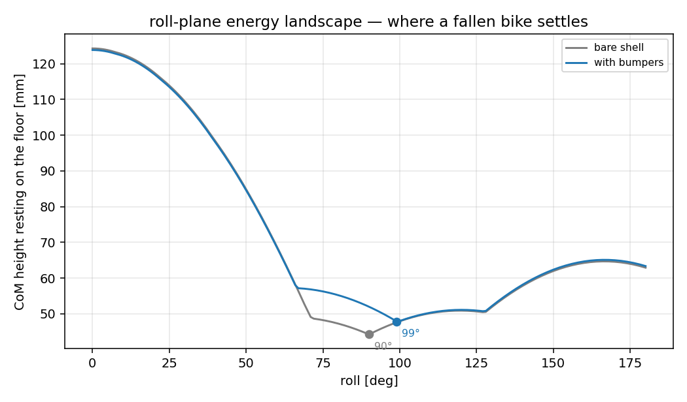
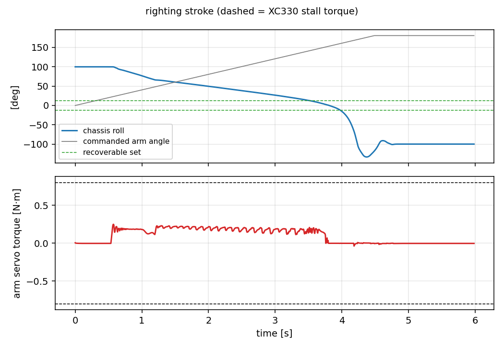
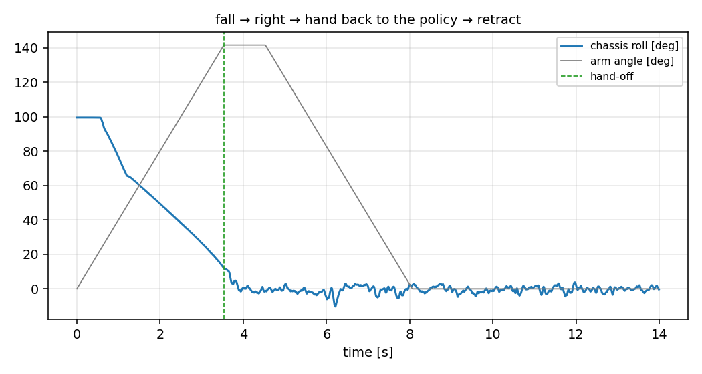

# Falling over, and getting back up

Study for a possible fourth servo: a symmetric mechanism that stands the bike
back up after it falls. Status: **analysis only, nothing decided, nothing
ordered (2026-08).** Everything below is measured in sim against the current
parameter set; every dimension in the `righting` block of
`config/bike_params.yaml` is a placeholder that the tools here can re-sweep.

Two tools:

```sh
python analysis/no_return.py                    # where recovery stops being possible
python analysis/self_righting.py profile        # what a fallen bike rests on
python analysis/self_righting.py rest           # ...checked against real falls
python analysis/self_righting.py lift           # what the arm has to be
python analysis/self_righting.py sequence       # fall -> right -> hand off -> retract
```

and one model switch, `build_model(..., righting=True)`, which makes the
chassis lumps collidable (so a fall lands on the parts that would really
touch the floor rather than sinking through them) and adds whatever of
`righting.bumper` / `righting.arm` is present. It is off everywhere else, so
none of this touches training, teleop or deployment.

## Summary

| question | answer |
|---|---|
| Is there a "tipping angle"? | **No.** A two-wheeler has no statically stable roll region. The boundary is a curve in *(roll, roll rate)* and it moves with speed |
| Where does recovery stop? | `general_rl`: **16.3° right / 11.8° left** at standstill with zero roll rate, **24°** at 0.4–0.8 m/s. Nothing survives a roll rate over ~4 rad/s |
| How long from "visibly falling" to flat? | **0.23–0.56 s**, median 0.32 s. From 30° of roll it is ~0.13 s |
| Can the fall be caught? | **No.** Design a righting mechanism, not a catch |
| Does the bike rest consistently? | **Yes, already.** 90.2° roll / 10.3° pitch on every fall tried, independent of steer angle |
| What should the side geometry be? | A short pad per side just proud of the drive servos. **Not** a wide outrigger — every wide or tall rail tried made it worse |
| Can one XC330 lift it? | **Only through a reduction.** 0.65–0.75 N·m at the arm; direct drive is a coin flip on a half-empty 3S pack. At 3:1 it is 0.25 N·m at the servo |

---

## 1. The point of no return

`analysis/no_return.py`. The bike has no statically stable roll region — the
contact patch is a line, so the CoM is over the support at exactly one angle.
"Point of no return" is a boundary in the *(roll, roll rate)* phase plane, and
it moves with forward speed, because a rolling bike can steer under its own
CoM while a standing one can only crawl the rear omni sideways (kinematic
ceiling 0.82 m/s, and less than that once torque limits bite).

The script measures the boundary two ways, because they answer two different
questions.

### Cold boundary — the fall-detector's curve

From the settled straight-rolling state, impose a roll angle and roll rate and
bisect the largest angle the controller still walks away from. This is the
boundary in the two signals the AHRS actually reports, so it is what a trigger
rule can be written against. `general_rl`, largest initial lean recovered
[deg]:

| speed | side | ‑1.0 | 0.0 | 1.0 | 2.0 | 3.0 | 4.0 | 5.0 | 6.0 rad/s |
|---|---|---|---|---|---|---|---|---|---|
| 0.00 | right | 20.6 | 16.3 | 12.6 | 8.8 | 3.0 | 0 | 0 | 0 |
| 0.00 | left | 16.5 | 11.8 | 4.7 | 2.6 | 0.4 | 0 | 0 | 0 |
| 0.40 | right | 28.1 | 24.0 | 18.8 | 11.4 | 7.9 | 2.1 | 0 | 0 |
| 0.40 | left | 13.1 | 10.5 | 7.5 | 1.3 | 0 | 0 | 0 | 0 |
| 0.80 | right | 30.9 | 24.2 | 17.8 | 12.6 | 8.8 | 3.6 | 0.4 | 0 |
| 0.80 | left | 16.3 | 12.2 | 9.0 | 4.5 | 0 | 0 | 0 | 0 |

Three things fall out of that table.

**Speed buys recovery, and only on one side.** Right-hand recovery roughly
doubles between standstill and 0.4 m/s (16.3° → 24.0°) because steering
authority appears; left-hand recovery does not improve at all. That is not
physics, it is the policy: the LQR run of the same sweep is symmetric to the
last digit (12.0/12.0 at ‑1 rad/s, 8.1/8.1 at 0), so the model is
mirror-symmetric and `general_rl` simply has not learned the left side as
well. It is the same asymmetry `analysis/mirror_equivariance.py` looks for,
here costing ~30–50% of the recoverable set. **Worth a training fix before it
is worth a mechanism.**

**Roll rate matters far more than roll angle.** At standstill the boundary
runs from 16° at zero rate to nothing at 4 rad/s. A trigger on roll alone is
useless; it has to be a curve.

**The LQR is much weaker than the policy** (8.1° vs 16.3° at standstill, and
nothing at all above 2 rad/s), so the numbers above are the *best* case. On
the analytic controller the recoverable set is about half as large.

### Pulse — the honest boundary, and the timing budget

Shove the upright bike with a lateral force pulse and bisect the pulse
*duration*. The longest pulse still recovered ends at the last savable state;
nothing is imposed and nothing is frozen. Two results.

The no-return state is **not** characterised by roll angle. Across speeds and
push magnitudes it lands at roll ‑3.2…13.6°, rate ‑1.4…3.8 rad/s, with the
rear contact already travelling 0.1–0.6 m/s in the catch direction against a
0.82 m/s ceiling. What has run out at that instant is *crawl authority*, not
lean margin — the bike is still nearly upright and already lost.

And losing it is not the same event as looking like it. Median latency from
the point of no return to `|roll| > 10°` is 0.16 s for `general_rl` and
**1.04 s** for the LQR, which limps near upright for a second or more before
it goes. Timed from that visible onset instead:

| roll passes | time since onset [s] (min / med / max) | roll rate there [rad/s] |
|---|---|---|
| 30° | 0.095 / 0.192 / 0.385 | 1.0 / 3.9 / 7.1 |
| 45° | 0.140 / 0.237 / 0.475 | 4.7 / 6.7 / 11.6 |
| 60° | 0.170 / 0.270 / 0.510 | 6.3 / 8.5 / 11.9 |
| 75° | 0.205 / 0.297 / 0.540 | 7.9 / 10.2 / 14.7 |
| 90° | 0.232 / 0.318 / 0.564 | 11.8 / 13.4 / 15.6 |

**A detector firing at 30° of roll has ~0.13 s before the bike is flat.** That
is the whole design conclusion of part 1: no servo arrests that. The mechanism
acts *after* the bike is down.

### What the detector is still good for

0.13 s is useless for catching and plenty for the rest:

* **Cut drive torque.** A saturated crawl command at impact drags the bike
  across the floor and loads the drivetrain sideways.
* **Centre the steering.** The XC330 does ~11.8 rad/s no-load, so ~90° of
  steer can be unwound inside the budget. Not needed for the resting attitude
  (measured independent of steer, below) but it makes the righting stroke
  start from a known pose.
* **Park the righting arm at stow** so it is not caught extended by the impact.

A safe trigger from the table above: `|roll| > 35°` **and** `roll_rate ·
sign(roll) > 2 rad/s`. Nothing in the cold sweep recovers from there — the
largest boundary value anywhere is 30.9°, and that at a roll rate of ‑1 rad/s
(i.e. already returning). A pure `|roll| > 35°` trigger would also be safe;
the rate term just stops it firing on a hard lean that is on its way back.


---

## 2. What a fallen bike rests on

`analysis/self_righting.py profile` rotates the bike about +X, drops it onto
the floor at each angle and reports CoM height — a purely geometric roll-plane
energy landscape, milliseconds per candidate, so side geometry can be swept
before anything is simulated. `rest` then checks it against real falls.

### The bare bike is already consistent

Over eight falls (±4 N and ±8 N pulses, 0.25 s and 0.40 s, standing and at
0.6 m/s) the bare bike settles at **90.2° roll / 10.3° pitch every single
time**, spread 0.0°, carried by the front tyre and the right drive servo. It
is also completely independent of the steer angle at the moment of the fall
(checked at 0/20/45/90/135/180°) — the front wheel is front–back symmetric and
rolls to wherever it likes without moving the chassis.

The landscape explains why. The 90° minimum is the global one (CoM 44.2 mm);
everything past it is a shelf 0.3 mm deep that drains straight back. There is
no stable inverted attitude to fall into.

So the resting-attitude problem is already solved by accident. What is *not*
solved is the load path: the bike is resting on a drive-servo case, which is a
sealed gearbox housing and not a structural member.

### Wide outriggers make it worse, not better

The obvious move — outrigger rails to define the rest attitude — is wrong, and
the sweep says so clearly. Rails at 60–75 mm half-span and 100–130 mm above
the axle raise the static barrier from 66 mJ to 200–440 mJ, which looks like
an improvement, and then in dynamics the bike ends up **on its back** in a
quarter of the falls, rest spread 65–115°:

| geometry | static rest | static barrier | measured rest spread |
|---|---|---|---|
| bare | 90° | 66 mJ | **0.0°** |
| rail 70 mm / 100 mm | 66° | 220 mJ | 114.6° |
| rail 70 mm / 130 mm | 70° | 436 mJ | 110.8° |
| rail 75 mm / 40 mm | 50° | 33 mJ | 76.3° |
| rail 60 mm / 74 mm | 65° | 61 mJ | 65.7° |

Two mechanisms, both worth remembering:

1. **The static barrier is not the operative constraint.** A fall arrives at
   the floor with 140–460 mJ of roll kinetic energy against a 66 mJ barrier
   and still stops dead, because a broad flat landing dissipates nearly all of
   it. A thin rail high on the chassis is a *fulcrum*, not a stop — it lets
   the bike vault over on a nearly elastic line contact.
2. **A rail high on the chassis becomes a foot when the bike is inverted.**
   That is what creates the stable upside-down attitude the bare bike does not
   have. Whatever the side geometry is, the *top* of the bike has to stay
   narrow.

### The recommendation: a servo guard, not an outrigger

A short capsule pad per side, sitting just outboard of the drive servo it
protects and spanning only that servo's length:

| | value | note |
|---|---|---|
| half-span | 46 mm | servo outer face is at 44.25 mm |
| height above rear axle | 50 mm | servo lower face |
| x extent | 26–64 mm | the drive servos sit at x = 45 mm |
| radius | 6 mm | outer surface reaches 52 mm |

Measured over the same eight falls: **spread 0.0°**, resting at 99.6° roll /
10.2° pitch on pad + chassis box + servo, again independent of steer angle.
It preserves the landscape that already works and moves the load off the
gearbox case. Righting work drops slightly (798 → 772 mJ) because the pad
holds the bike a few degrees further over but a millimetre higher.

This is the geometry now in `righting.bumper`. It is deliberately the smallest
change that does the job; the sweep is there to re-run if the chassis changes.



### What is still unmodelled

* **Pitch.** The `profile` curve is roll-plane only. The dynamic `rest` runs
  are full 3-D and agree, but a candidate geometry that changes the fore/aft
  balance needs `rest`, not `profile`.
* **The floor.** One flat, hard, µ = 0.9 plane. Carpet, a table edge, or
  falling against a wall are all outside this.
* **Impact durability.** The peak roll rate at the floor is 12–16 rad/s
  (690–890 °/s); nothing here says what survives that, only where it lands.

---

## 3. The righting arm

One extra XC330-T181 swinging a single arm about a fore/aft axis. A *single*
arm is enough for a symmetric mechanism because the servo runs in extended
position mode with no ctrlrange: 0° is stowed straight up, and the arm swings
with `sign(roll)` to reach whichever floor the bike is lying on. The hinge
axis is body +X and so is roll, so the arm points at the floor when
`roll + arm ≈ 180°`, and past 180° the foot lands *inboard* of the contact
line — which is the side it has to push on to rotate the bike up rather than
further over.

### Sizing

`lift` ramps the arm into the floor at 0.7 rad/s (slow on purpose, so the
reading is quasi-static torque and not an impulse) and reads the actuator
force. Torque at the **arm**, direct drive:

| arm length | pivot z | peak torque | reaches upright |
|---|---|---|---|
| 70 mm | 20 mm | 0.673 N·m | yes |
| 80 mm | 30 mm | 0.691 N·m | yes |
| 90 mm | 30 mm | 0.748 N·m | yes |
| 100 mm | 30 mm | 0.800 N·m (saturated) | yes |
| 120–140 mm | any | saturated | no, stalls at ~50° |
| ≤ 60 mm | any | 0.39–0.58 N·m | no, cannot reach far enough inboard |

Against an XC330-T181 that is 0.80 N·m at 12 V, **0.76 N·m at the 3S nominal
11.1 V and ~0.66 N·m at the 9.9 V cutoff**, every geometry that gets all the
way up is a coin flip on a half-empty pack. Note that a *longer* arm needs
*more* torque, not less: the servo has to react the full push moment, and
lengthening the arm lengthens its own moment arm faster than it reduces the
force needed.

Nothing about this stroke wants speed — two seconds is fine — so the fix is a
reduction. At **3:1** (the same ratio the drive belts already use) the
configured 80 mm / 30 mm arm needs **0.249 N·m at the servo, 38% of the
9.9 V stall.** That is the recommendation.

Mass cost of the whole mechanism: 63 g (servo 23 g, arm + foot 20 g, two pads
20 g) on a 1016 g bike, +6%.



The torque trace is flat at 0.20–0.25 N·m across the stroke with a small spike
at first contact — no bad spot to design around. The interesting part of that
plot is the *roll* trace: with the arm swept all the way to 180° and no
controller, the bike goes through upright at t ≈ 3.4 s and falls over the
other side. **The arm must stop at hand-off, not complete its stroke.**

### The sequence

`self_righting.py sequence` runs it end to end and it works:

```
fell to 100 deg; handed over at t = 3.53 s; final roll -1.1 deg, arm at 0 deg
upright and balancing
```



The hand-off rule: engage `general_rl` when `|roll| < 12°` **and**
`|roll_rate| < 3 rad/s`, with the arm holding position. 12° is inside the
policy's cold recoverable set on *both* sides at standstill (16.3° right,
11.8° left) with margin — which is exactly why the left/right asymmetry in
part 1 matters here: the hand-off threshold is set by the weaker side.

Then retract, but only after the policy has held it for ~1 s. Pulling the prop
out early is the same as never having put it there. In the run above the
retract runs from t = 4.5 s to 8.0 s at the same 0.7 rad/s and the roll trace
never exceeds ±12° during it.

Total: ~3.5 s fall-to-balancing, ~8 s fall-to-stowed. Within the "a few
seconds is fine" budget.

### Open questions before this is a design

* **Where does the arm stow?** The configured pivot (x = 90 mm, 30 mm above
  the axle) puts a stowed 80 mm arm straight up through the chassis box. The
  torque study does not care; packaging does. Rotating the stow angle or
  moving the pivot aft are both free in `lift` — re-sweep.
* **The foot.** Modelled as a 10 mm sphere at µ = 0.9. If it slips instead of
  planting, the stroke changes completely. A rubber foot, or a small spike,
  or biasing the geometry so the push is more vertical, are all untested.
* **Reduction type.** 3:1 by spur gears or by a belt like the drive; the study
  only assumes the ratio. Backdrivability matters: the arm sees an impact load
  every time the bike falls with it stowed.
* **Does the policy need to know?** Right now the hand-off is a hard switch
  into `general_rl` at 12°. Training the policy with the arm present, or with
  episodes that start from the arm's hand-off distribution, would widen the
  window. Untried.
* **Fifth servo?** Not considered. One arm through ±180° covers both sides;
  a second arm would only buy a faster, more symmetric stroke.

---

## Consequences for the rest of the repo

* `config/bike_params.yaml` gained a `righting` block, which changes the
  parameter digest. **The deployment bundle had to be re-exported**
  (`python -m aow_sim.export_deploy`) and any bundle already on the Pi is now
  stale — `hw/state.py` will refuse it, by design.
* `build_model(..., righting=True)` is opt-in and off everywhere else. The
  chassis lumps stay `contype=0` in every other configuration, so training,
  teleop and deployment see exactly the model they saw before.
* The single biggest improvement available here is not a mechanism at all:
  **`general_rl` recovers 30–50% less lean to the left than to the right.**
  Fixing that widens the recoverable set, raises the safe hand-off threshold,
  and reduces how often the mechanism is needed in the first place.
