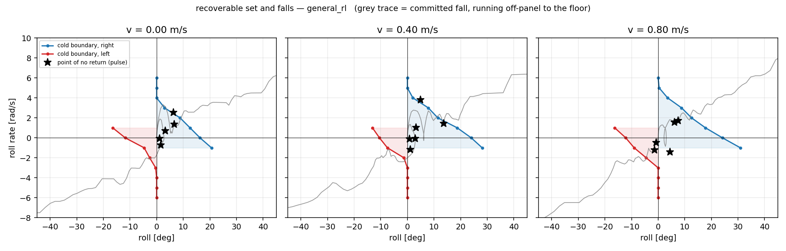
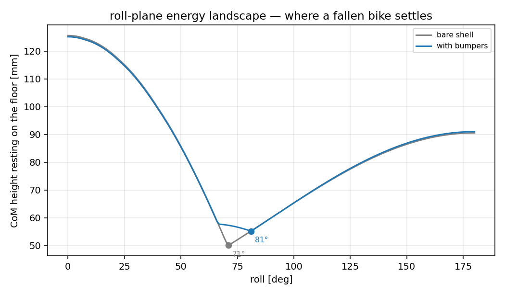
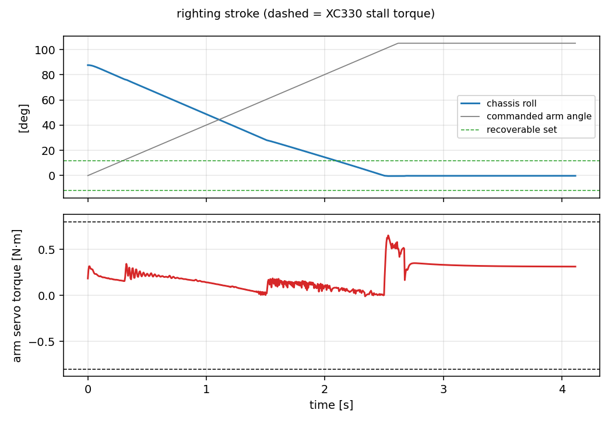
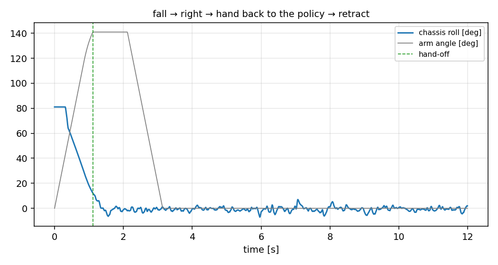

# Falling over, and getting back up

Study for a possible fourth servo: a symmetric mechanism that stands the bike
back up after it falls. Status: **analysis only, nothing decided, nothing
ordered (2026-08).** Everything below is measured in sim against the current
parameter set; every dimension in the `righting` block of
`config/bike_params.yaml` is a placeholder that the tools here can re-sweep.

Two tools:

```sh
python analysis/no_return.py                    # where recovery stops being possible
python analysis/self_righting.py profile        # what a fallen bike rests on
python analysis/self_righting.py rest           # ...checked against real falls
python analysis/self_righting.py lift           # what the arm has to be
python analysis/self_righting.py sequence       # fall -> right -> hand off -> retract
```

and one model switch, `build_model(..., righting=True)`, which makes the
chassis lumps collidable (so a fall lands on the parts that would really
touch the floor rather than sinking through them) and adds whatever of
`righting.bumper` / `righting.arm` is present. It is off everywhere else, so
none of this touches training, teleop or deployment.

Part 4 adds a second, better mechanism — a mirrored **wing pair** on one servo
— selected by `wings=True` and by `--wings` on every subcommand above:

```sh
python analysis/self_righting.py lift --wings --sweep   # pivot height + gear fit
python analysis/self_righting.py sequence --wings
python -m aow_sim.record --script right                 # video, rear view
python -m aow_sim.run_drive --teleop --wings            # 9 extend, 4 retract, . shove
```

## Summary

| question | answer |
|---|---|
| Is there a "tipping angle"? | **No.** A two-wheeler has no statically stable roll region. The boundary is a curve in *(roll, roll rate)* and it moves with speed |
| Where does recovery stop? | `general_rl`: **16.3° right / 11.8° left** at standstill with zero roll rate, **24°** at 0.4–0.8 m/s. Nothing survives a roll rate over ~4 rad/s |
| How long from "visibly falling" to flat? | **0.23–0.56 s**, median 0.32 s. From 30° of roll it is ~0.13 s |
| Can the fall be caught? | **No.** Design a righting mechanism, not a catch |
| Does the bike rest consistently? | **Yes, already.** 90.2° roll / 10.3° pitch on every fall tried, independent of steer angle |
| What should the side geometry be? | A short pad per side just proud of the drive servos. **Not** a wide outrigger — every wide or tall rail tried made it worse |
| Can one XC330 lift it? | **Only through a reduction.** 0.65–0.75 N·m at the arm; direct drive is a coin flip on a half-empty 3S pack. At 3:1 it is 0.25 N·m at the servo |
| One arm or a mirrored pair? | **The pair, on these numbers.** It stops itself at upright instead of falling over the far side, hands off in 0.63 s instead of 1.11 s, and never has to know which side it fell on — for 35 g and a much tighter torque margin. See part 4 |
| Will righting flatten the battery? | **No, by a wide margin.** 0.74 A peak and 0.26 mAh per attempt, against 1.2–2.0 A just to drive. The servo's own overload cutout is the thing to bench-test, not the pack |

---

## 1. The point of no return

`analysis/no_return.py`. The bike has no statically stable roll region — the
contact patch is a line, so the CoM is over the support at exactly one angle.
"Point of no return" is a boundary in the *(roll, roll rate)* phase plane, and
it moves with forward speed, because a rolling bike can steer under its own
CoM while a standing one can only crawl the rear omni sideways (kinematic
ceiling 0.82 m/s, and less than that once torque limits bite).

The script measures the boundary two ways, because they answer two different
questions.

### Cold boundary — the fall-detector's curve

From the settled straight-rolling state, impose a roll angle and roll rate and
bisect the largest angle the controller still walks away from. This is the
boundary in the two signals the AHRS actually reports, so it is what a trigger
rule can be written against. `general_rl`, largest initial lean recovered
[deg]:

| speed | side | ‑1.0 | 0.0 | 1.0 | 2.0 | 3.0 | 4.0 | 5.0 | 6.0 rad/s |
|---|---|---|---|---|---|---|---|---|---|
| 0.00 | right | 20.6 | 16.3 | 12.6 | 8.8 | 3.0 | 0 | 0 | 0 |
| 0.00 | left | 16.5 | 11.8 | 4.7 | 2.6 | 0.4 | 0 | 0 | 0 |
| 0.40 | right | 28.1 | 24.0 | 18.8 | 11.4 | 7.9 | 2.1 | 0 | 0 |
| 0.40 | left | 13.1 | 10.5 | 7.5 | 1.3 | 0 | 0 | 0 | 0 |
| 0.80 | right | 30.9 | 24.2 | 17.8 | 12.6 | 8.8 | 3.6 | 0.4 | 0 |
| 0.80 | left | 16.3 | 12.2 | 9.0 | 4.5 | 0 | 0 | 0 | 0 |

Three things fall out of that table.

**Speed buys recovery, and only on one side.** Right-hand recovery roughly
doubles between standstill and 0.4 m/s (16.3° → 24.0°) because steering
authority appears; left-hand recovery does not improve at all. That is not
physics, it is the policy: the LQR run of the same sweep is symmetric to the
last digit (12.0/12.0 at ‑1 rad/s, 8.1/8.1 at 0), so the model is
mirror-symmetric and `general_rl` simply has not learned the left side as
well. It is the same asymmetry `analysis/mirror_equivariance.py` looks for,
here costing ~30–50% of the recoverable set. **Worth a training fix before it
is worth a mechanism.**

**Roll rate matters far more than roll angle.** At standstill the boundary
runs from 16° at zero rate to nothing at 4 rad/s. A trigger on roll alone is
useless; it has to be a curve.

**The LQR is much weaker than the policy** (8.1° vs 16.3° at standstill, and
nothing at all above 2 rad/s), so the numbers above are the *best* case. On
the analytic controller the recoverable set is about half as large.

### Pulse — the honest boundary, and the timing budget

Shove the upright bike with a lateral force pulse and bisect the pulse
*duration*. The longest pulse still recovered ends at the last savable state;
nothing is imposed and nothing is frozen. Two results.

The no-return state is **not** characterised by roll angle. Across speeds and
push magnitudes it lands at roll ‑3.2…13.6°, rate ‑1.4…3.8 rad/s, with the
rear contact already travelling 0.1–0.6 m/s in the catch direction against a
0.82 m/s ceiling. What has run out at that instant is *crawl authority*, not
lean margin — the bike is still nearly upright and already lost.

And losing it is not the same event as looking like it. Median latency from
the point of no return to `|roll| > 10°` is 0.16 s for `general_rl` and
**1.04 s** for the LQR, which limps near upright for a second or more before
it goes. Timed from that visible onset instead:

| roll passes | time since onset [s] (min / med / max) | roll rate there [rad/s] |
|---|---|---|
| 30° | 0.095 / 0.192 / 0.385 | 1.0 / 3.9 / 7.1 |
| 45° | 0.140 / 0.237 / 0.475 | 4.7 / 6.7 / 11.6 |
| 60° | 0.170 / 0.270 / 0.510 | 6.3 / 8.5 / 11.9 |
| 75° | 0.205 / 0.297 / 0.540 | 7.9 / 10.2 / 14.7 |
| 90° | 0.232 / 0.318 / 0.564 | 11.8 / 13.4 / 15.6 |

**A detector firing at 30° of roll has ~0.13 s before the bike is flat.** That
is the whole design conclusion of part 1: no servo arrests that. The mechanism
acts *after* the bike is down.

### What the detector is still good for

0.13 s is useless for catching and plenty for the rest:

* **Cut drive torque.** A saturated crawl command at impact drags the bike
  across the floor and loads the drivetrain sideways.
* **Centre the steering.** The XC330 does ~11.8 rad/s no-load, so ~90° of
  steer can be unwound inside the budget. Not needed for the resting attitude
  (measured independent of steer, below) but it makes the righting stroke
  start from a known pose.
* **Park the righting arm at stow** so it is not caught extended by the impact.

A safe trigger from the table above: `|roll| > 35°` **and** `roll_rate ·
sign(roll) > 2 rad/s`. Nothing in the cold sweep recovers from there — the
largest boundary value anywhere is 30.9°, and that at a roll rate of ‑1 rad/s
(i.e. already returning). A pure `|roll| > 35°` trigger would also be safe;
the rate term just stops it firing on a hard lean that is on its way back.



---

## 2. What a fallen bike rests on

`analysis/self_righting.py profile` rotates the bike about +X, drops it onto
the floor at each angle and reports CoM height — a purely geometric roll-plane
energy landscape, milliseconds per candidate, so side geometry can be swept
before anything is simulated. `rest` then checks it against real falls.

### The bare bike is already consistent

Over eight falls (±4 N and ±8 N pulses, 0.25 s and 0.40 s, standing and at
0.6 m/s) the bare bike settles at **90.2° roll / 10.3° pitch every single
time**, spread 0.0°, carried by the front tyre and the right drive servo. It
is also completely independent of the steer angle at the moment of the fall
(checked at 0/20/45/90/135/180°) — the front wheel is front–back symmetric and
rolls to wherever it likes without moving the chassis.

The landscape explains why. The 90° minimum is the global one (CoM 44.2 mm);
everything past it is a shelf 0.3 mm deep that drains straight back. There is
no stable inverted attitude to fall into.

So the resting-attitude problem is already solved by accident. What is *not*
solved is the load path: the bike is resting on a drive-servo case, which is a
sealed gearbox housing and not a structural member.

### Wide outriggers make it worse, not better

The obvious move — outrigger rails to define the rest attitude — is wrong, and
the sweep says so clearly. Rails at 60–75 mm half-span and 100–130 mm above
the axle raise the static barrier from 66 mJ to 200–440 mJ, which looks like
an improvement, and then in dynamics the bike ends up **on its back** in a
quarter of the falls, rest spread 65–115°:

| geometry | static rest | static barrier | measured rest spread |
|---|---|---|---|
| bare | 90° | 66 mJ | **0.0°** |
| rail 70 mm / 100 mm | 66° | 220 mJ | 114.6° |
| rail 70 mm / 130 mm | 70° | 436 mJ | 110.8° |
| rail 75 mm / 40 mm | 50° | 33 mJ | 76.3° |
| rail 60 mm / 74 mm | 65° | 61 mJ | 65.7° |

Two mechanisms, both worth remembering:

1. **The static barrier is not the operative constraint.** A fall arrives at
   the floor with 140–460 mJ of roll kinetic energy against a 66 mJ barrier
   and still stops dead, because a broad flat landing dissipates nearly all of
   it. A thin rail high on the chassis is a *fulcrum*, not a stop — it lets
   the bike vault over on a nearly elastic line contact.
2. **A rail high on the chassis becomes a foot when the bike is inverted.**
   That is what creates the stable upside-down attitude the bare bike does not
   have. Whatever the side geometry is, the *top* of the bike has to stay
   narrow.

### The recommendation: a servo guard, not an outrigger

A short capsule pad per side, sitting just outboard of the drive servo it
protects and spanning only that servo's length:

| | value | note |
|---|---|---|
| half-span | 46 mm | servo outer face is at 44.25 mm |
| height above rear axle | 50 mm | servo lower face |
| x extent | 26–64 mm | the drive servos sit at x = 45 mm |
| radius | 6 mm | outer surface reaches 52 mm |

Measured over the same eight falls: **spread 0.0°**, resting at 99.6° roll /
10.2° pitch on pad + chassis box + servo, again independent of steer angle.
It preserves the landscape that already works and moves the load off the
gearbox case. Righting work drops slightly (798 → 772 mJ) because the pad
holds the bike a few degrees further over but a millimetre higher.

This is the geometry now in `righting.bumper`. It is deliberately the smallest
change that does the job; the sweep is there to re-run if the chassis changes.



### What is still unmodelled

* **Pitch.** The `profile` curve is roll-plane only. The dynamic `rest` runs
  are full 3-D and agree, but a candidate geometry that changes the fore/aft
  balance needs `rest`, not `profile`.
* **The floor.** One flat, hard, µ = 0.9 plane. Carpet, a table edge, or
  falling against a wall are all outside this.
* **Impact durability.** The peak roll rate at the floor is 12–16 rad/s
  (690–890 °/s); nothing here says what survives that, only where it lands.

---

## 3. The righting arm

One extra XC330-T181 swinging a single arm about a fore/aft axis. A *single*
arm is enough for a symmetric mechanism because the servo runs in extended
position mode with no ctrlrange: 0° is stowed straight up, and the arm swings
with `sign(roll)` to reach whichever floor the bike is lying on. The hinge
axis is body +X and so is roll, so the arm points at the floor when
`roll + arm ≈ 180°`, and past 180° the foot lands *inboard* of the contact
line — which is the side it has to push on to rotate the bike up rather than
further over.

### Sizing

`lift` ramps the arm into the floor at 0.7 rad/s (slow on purpose, so the
reading is quasi-static torque and not an impulse) and reads the actuator
force. Torque at the **arm**, direct drive:

| arm length | pivot z | peak torque | reaches upright |
|---|---|---|---|
| 70 mm | 20 mm | 0.673 N·m | yes |
| 80 mm | 30 mm | 0.691 N·m | yes |
| 90 mm | 30 mm | 0.748 N·m | yes |
| 100 mm | 30 mm | 0.800 N·m (saturated) | yes |
| 120–140 mm | any | saturated | no, stalls at ~50° |
| ≤ 60 mm | any | 0.39–0.58 N·m | no, cannot reach far enough inboard |

Against an XC330-T181 that is 0.80 N·m at 12 V, **0.76 N·m at the 3S nominal
11.1 V and ~0.66 N·m at the 9.9 V cutoff**, every geometry that gets all the
way up is a coin flip on a half-empty pack. Note that a *longer* arm needs
*more* torque, not less: the servo has to react the full push moment, and
lengthening the arm lengthens its own moment arm faster than it reduces the
force needed.

Nothing about this stroke wants speed — two seconds is fine — so the fix is a
reduction. At **3:1** (the same ratio the drive belts already use) the
configured 80 mm / 30 mm arm needs **0.249 N·m at the servo, 38% of the
9.9 V stall.** That is the recommendation.

Mass cost of the whole mechanism: 63 g (servo 23 g, arm + foot 20 g, two pads
20 g) on a 1016 g bike, +6%.



The torque trace is flat at 0.20–0.25 N·m across the stroke with a small spike
at first contact — no bad spot to design around. The interesting part of that
plot is the *roll* trace: with the arm swept all the way to 180° and no
controller, the bike goes through upright at t ≈ 3.4 s and falls over the
other side. **The arm must stop at hand-off, not complete its stroke.**

### The sequence

`self_righting.py sequence` runs it end to end and it works:

```
fell to 81 deg; handed over at t = 1.11 s; final roll 1.8 deg, arm at 0 deg
upright and balancing
```



Two numbers here moved after this section was first written, and neither is a
change to the arm itself. It now falls to **81°** rather than 100° because the
roof ridge (part 5) is present and the bike rests further upright on it; and
hand-off comes at **1.11 s** rather than 3.53 s because the deploy rate is now
scheduled on roll angle rather than flat (part 4). The arm is the same arm —
it just shares the improvements.

The hand-off rule: engage `general_rl` when `|roll| < 12°` **and**
`|roll_rate| < 3 rad/s`, with the arm holding position. 12° is inside the
policy's cold recoverable set on *both* sides at standstill (16.3° right,
11.8° left) with margin — which is exactly why the left/right asymmetry in
part 1 matters here: the hand-off threshold is set by the weaker side.

Then retract, but only after the policy has held it for ~1 s. Pulling the prop
out early is the same as never having put it there. In the run above the
retract runs from t = 4.5 s to 8.0 s at the same 0.7 rad/s and the roll trace
never exceeds ±12° during it.

Total: ~3.5 s fall-to-balancing, ~8 s fall-to-stowed. Within the "a few
seconds is fine" budget.

### Open questions before this is a design

* **Where does the arm stow?** The configured pivot (x = 90 mm, 30 mm above
  the axle) puts a stowed 80 mm arm straight up through the chassis box. The
  torque study does not care; packaging does. Rotating the stow angle or
  moving the pivot aft are both free in `lift` — re-sweep.
* **The foot.** Modelled as a 10 mm sphere at µ = 0.9. If it slips instead of
  planting, the stroke changes completely. A rubber foot, or a small spike,
  or biasing the geometry so the push is more vertical, are all untested.
* **Reduction type.** 3:1 by spur gears or by a belt like the drive; the study
  only assumes the ratio. Backdrivability matters: the arm sees an impact load
  every time the bike falls with it stowed.
* **Does the policy need to know?** Right now the hand-off is a hard switch
  into `general_rl` at 12°. Training the policy with the arm present, or with
  episodes that start from the arm's hand-off distribution, would widen the
  window. Untried.
* **Fifth servo?** Not considered. One arm through ±180° covers both sides;
  a second arm would only buy a faster, more symmetric stroke.

---

## 4. The wing pair

A second mechanism, and on the numbers below a better one. Instead of one arm
reaching for whichever floor the bike is lying on, a **mirrored pair of wings,
one per side, on a single servo through a gear train** — meshed gears at the
two pivots with a reversal on one side, so the pair counter-rotates and both
wings deploy outboard and down together. Whichever one is on the fallen side
plants and levers; the other swings out into the air.

`build_model(..., righting=True, wings=True)` builds it, and `--wings` selects
it on every `self_righting.py` subcommand. The two mechanisms are never in the
same model — the arm's 43 g would land in every wing torque reading — but they
share the bumper pads from part 2.

The gear train is not modelled. All it contributes to the dynamics is the
inversion, as a joint equality `θ_left = −θ_right`, and the reduction, as
`gear_ratio` folded into the actuator's forcerange. Mirroring holds to
**0.02°** on a pinned chassis and opens to ~0.7° once one wing is loaded
against the floor and the other is in the air — soft-constraint compliance,
which is about what real gear backlash would look like anyway.

### It stops itself at upright

This is the result that decides it. Run the stroke to completion with **no
controller at all**:

| | arm | wing pair |
|---|---|---|
| passes through upright at | 3.8 s | 2.6 s |
| ...and then | overshoots to −133°, **falls over the other side**, rest −99.5° | **stops at −0.1° and stays there** |
| final state, no controller | fallen, other side | dead still, on front tyre + both wing feet |

The single arm has to be *stopped* at hand-off, and part 3 says so explicitly.
The pair does not: as the bike comes up, the far wing reaches the floor on the
other side and the two feet plus the front tyre become a tripod. Fully
deployed, the bike sits at roll −0.06° / pitch +20.2° with `|qvel| = 0`.

That was the design's main risk inverted. The worry was that the far wing
plants *early* and wedges the bike short of the ±12° hand-off window. It does
not — it plants late, and the mechanism is a deployable **stand**. If a
hand-off fails, the bike parks upright instead of falling over, and can retry.

### The dogleg cranks OUTBOARD, and the angle is close to forced

Two constraints, neither of which the simulation will ever complain about,
because the wings collide with the floor and with **nothing else** and the gear
discs are drawn non-colliding.

**It must clear the rim of its own gear.** The crank is not a bend so much as an
offset: it carries the leg far enough outboard that the leg lands on the
*floor* rather than on the disc it is bolted to. So the outboard reach,
`crank_length · sin(crank_deg)`, has to exceed `disc_radius`, and cranking
inboard shortens that reach by the sine. That is what pins the angle near 90°
— it is not a free knob to trade against torque. `wing_fit()` reports it as
`leg_stands_on_gear`.

**It must not park through the drive servos.** They occupy |y| = 15.75–44.25 mm,
so an inboard-cranked leg stows straight through them and the model runs
perfectly happily. `test_stowed_wings_park_outboard_of_the_drive_servos` fails
if it ever goes back inboard.

Note the coupling the first constraint creates: `disc_radius` **grows with the
gear ratio**, so a bigger reduction demands a longer crank, which widens the
stance, which is exactly what the rest sweep in part 2 punishes. Reduction and
landing behaviour are not independent.

The angle is somewhat notional in any case — the real part will integrate the
crank into the gear itself, so what the parameter encodes is *where the leg
lands relative to the pivot*, not a physical bend.

### Sizing

`lift --wings --sweep` ladders the pivot height, which is what this design
turns on. Torques are at the servo through the 3:1:

| pivot z [mm] | leg [mm] | peak τ [N·m] | frac of 9.9 V | best roll | stow [mm] | clear [mm] | touch | max ratio |
|---|---|---|---|---|---|---|---|---|
| −30 | 95 | 0.380 | 0.58 | 94.3° | 143 | 14 | 27° | 1.54 |
| −30 | 115 | 0.613 | 0.93 | 0.0° | 163 | 14 | **27°** | **1.54** |
| −20 | 100 | 0.588 | 0.89 | 0.0° | 158 | 24 | 40° | 4.83 |
| **−15** | **95** | **0.582** | **0.88** | **0.0°** | **158** | **29** | **45°** | **4.83** |
| 0 | 95 | 0.618 | 0.94 | 0.0° | 173 | 44 | 57° | 4.83 |

Four things fall out, and the low pivot loses on three of them.

**Packaging does not reward a low pivot the way it looks like it should.** A
lower pivot ought to stow lower, and it does not, because it also needs a
longer leg to reach the floor and the extra length eats the gain exactly:
−20/100 and −15/95 both stow at 158 mm, and −30 stows *higher* at 163 mm
because of the 115 mm leg it needs.

**Neither does torque.** Flat at 0.58–0.61 N·m across the whole working band,
for the same reason running backwards: a lower pivot shortens the moment arm
the wing pushes on, and the longer leg needed to fix that costs it back.

**Riding-lean clearance goes the wrong way.** Stowed, the wings are the lowest
outboard thing on the bike after the wheels, so they set the roll angle at
which something other than a tyre touches down. At z = −30 that is **27°** —
*inside* the recoverable set of part 1 (up to 30.9°), so a lean the policy
could still save would drag a wing. z = −15 puts it at **45°**.

**And the gear train does not fit.** See below: at z = −30 the driven disc is
larger than the pivot is tall, capping the reduction at **1.54:1**. The
configured 3:1 is not buildable there at all. This is the hardest of the four
constraints and it is the one that actually decides.

Note what fails when the leg is too short: the 95 mm/−30 mm row peaks at
0.380 N·m, well inside budget, and still stalls at 94°. **It is reach that runs
out, not torque** — the wing cannot get far enough outboard of the contact line
to have any leverage. Adding torque would not have fixed it.

At the configured geometry the stroke needs **0.88 of the 9.9 V cutoff stall**,
tighter than the arm's 0.38 and the one number here that wants a larger
reduction before this is a design. Which runs straight into:

### The gear train is a fit problem, and it runs backwards

One central pinion meshing both wing gears means the centre distance is not
free — it is fixed by where the pivots are. So the ratio alone pins both radii:

```
r_pinion + r_disc = half_span      ->   r_pinion = half_span / (1 + ratio)
r_disc / r_pinion = ratio               r_disc   = half_span - r_pinion
```

The counter-intuitive part: **a bigger reduction shrinks the pinion**, it does
not grow the disc without limit. And the pinion is the 3D-printed part with a
floor on how fine its teeth can be. At the 35 mm pivot half-span, with a 6 mm
minimum printable pitch radius (a GUESS — print one):

| ratio | pinion [mm] | disc [mm] | |
|---|---|---|---|
| 2:1 | 11.7 | 23.3 | ok |
| **3:1** | **8.8** | **26.3** | **configured** |
| 4:1 | 7.0 | 28.0 | ok |
| 5:1 | 5.8 | 29.2 | pinion unprintable |
| 6:1 | 5.0 | 30.0 | pinion unprintable |

**Ceiling: 4.83:1.** So the obvious fix for the 0.88 torque margin — go to 4:1
or 5:1 — is available only just, and 5:1 is already past it. Widening the pivot
half-span is the lever that buys more, since every radius here scales with it.

The second limit binds at low pivots: the disc is centred on the pivot, so it
cannot be taller than the pivot is off the floor. That is what collapses the
ceiling to 1.54:1 at z = −30 and 2.98:1 at z = −25, and it is the strongest
argument against dropping the pivot further. The discs are drawn in the model —
weightless, non-colliding — precisely so this can be looked at rather than
computed: `build_model.wing_fit()` reports all of it, and `lift --wings` prints
the ladder.

### Multi-turn — actually not required, once the stroke is sized honestly

The sketch anticipated needing it, and at a 135° deploy it does: 405° at the
servo through the 3:1, or 1.12 turns. But 135° was never the requirement — it
was a **super-kickstand**, far past what righting needs. At a 105° deploy the
full stroke is **315° at the servo, 0.88 turns**, and hand-off happens earlier
still, so the whole mechanism fits inside a single turn.

That is a real simplification and it is worth protecting: `deploy_deg` and
`gear_ratio` multiply, so `deploy_deg × gear_ratio < 360` is the condition, and
raising the reduction for torque headroom spends it. At 4:1 even 105° is
420° (1.17 turns) and extended-position mode comes back.

`lift --wings` prints the turns and flags the crossing either way.

### Current: the pack is not the constraint

The case that matters is the one where the bike is already down — the fall
detector has cut the drive policy, so the righting servo is the **only** motor
load on the pack. Priced off the torque trace through the motor constant
`kt = stall_torque / stall_current` (0.80 N·m / 0.88 A, and kt does not move
with pack voltage, so a sim torque converts to amps directly):

| | |
|---|---|
| peak current | **0.74 A** at the XC330 (its own stall is 0.88 A) |
| charge per righting attempt | **0.26 mAh** over a ~4 s stroke |
| normal driving, for comparison | 1.2–2.0 A average, ~4 A peak |
| a 1300 mAh pack | ~5000 attempts, if it did nothing else |

So righting is the **lowest-current thing the bike ever does** — roughly a
third of the average draw of simply driving, and about a fifth of the peak.
Nothing here threatens the pack, and the bulk capacitance already specified in
`untethered-setup.md` for drive transients covers a load this small trivially.

What is *not* ruled out by this is the servo's own limits: 0.7 A for four
seconds is near-stall operation for a motor that small, and Dynamixels shut
down on their own overload/thermal protection rather than on pack voltage. That
is the failure mode to watch, and it is a bench test, not a simulation.

### End to end

`sequence --wings`, and `python -m aow_sim.record --script right` for the
video (`traces/right_wings.mp4`, rear view):

```
fell to 88 deg; handed over at t = 0.63 s; final roll -0.7 deg, wings at 0 deg
upright and balancing
```

**0.63 s to hand-off against the arm's 1.11 s**, on the same fall, same policy,
same slew schedule. The pair is faster because it starts pushing immediately —
there is no ~0.5 s of swinging the arm around to find the floor first. (Both
figures are roughly 3x quicker than when this was first written, because the
deploy rate is now scheduled rather than flat; the *ratio* between the two
mechanisms is what this section is about, and it is unchanged.)

Falls stay repeatable. `rest --wings` over the same eight falls gives **94.4°
roll / 13.9° pitch, spread 0.1°**, and the static barrier onward triples
(33 → 104 mJ). The outboard-cranked wings do now take part in the landing —
support is bumper + chassis + front tyre + wing foot rather than bumper +
chassis + drive servo — which moves the rest attitude from 99.6° to 94.4° and
brings touchdown forward (contact at ~45° of roll instead of ~67°, so touchdown
KE drops to 96–343 mJ). No fall ended on its back and the spread is still
essentially zero, so the landscape that works is preserved; but the wing feet
are now impact-loaded parts, which the arm's feet never were.

### The cost

98 g on a 1016 g bike (**+9.6%**) against the arm's 63 g (+6.2%): two wings
40 g, servo 23 g, gear train 15 g, pads 20 g. So the pair buys the self-limiting
stroke, the faster stroke, the side-agnostic stroke and the flat stow for 35 g
and a much tighter torque margin.

### Still open

* **Torque margin, and it is now boxed in.** 0.88 of the 9.9 V stall is not
  enough headroom, and the gear-fit ceiling of 4.83:1 means the usual fix has
  almost no room left. Widening the pivot half-span past 35 mm is the lever
  that actually buys margin, and it has not been swept.
* **`min_pinion_radius` is a GUESS.** The whole fit ceiling hangs off it, so it
  is the single most valuable thing to replace with a measurement — print a
  test pinion.
* **Impact loading on the wing feet.** They are now part of the landing, and
  nothing here says what survives a 12–16 rad/s arrival.
* **The stow angle.** `crank_deg` is now pinned by the outboard-clearance
  requirement above, but `stow_deg` was set from the sketch and never swept.
* **Wing-on-chassis interference is not simulated.** The wings collide with the
  floor and with nothing else, so the stowed pose has to be checked
  geometrically. See `_add_wings`.
* **Nothing here is trained.** The hand-off is still a hard switch into
  `general_rl` at 12°, and the policy has never seen a wing.

---

---

## 5. The roof: not landing on its back

Part 2 measured that the bare bike has no stable inverted attitude and left it
there. That was too generous a reading. The inverted "shelf" past 150° is
**2.69 mm of CoM height — about 27 mJ — and falls arrive at the floor with
75–300 mJ.** It is a rounding error, not a barrier. It also turns out to be
reachable on purpose: reverse at speed, then command a 180° flip, and the bike
lands on its back every time.

What defines the top of the bike today is the **AHRS**: a flat-topped
30 × 30 × 12 box at z = 136 mm, the highest lump on the vehicle, and exactly
what carries the load at 180°. `righting.roof` replaces that plateau with a
capsule along +X — round in the roll plane so an inverted bike rolls off it,
hemispherical ends supplying the fore/aft doming for free. A ridge, not a dome,
which is the right call: it makes **roll** unstable while leaving **pitch**
neutral, and the measurements confirm it (starting pitch of 0° vs 15° gives
bit-identical outcomes — the bike just rocks along the ridge and settles back).

New tool:

```sh
python analysis/self_righting.py invert --wings           # drop it upside down
python analysis/self_righting.py invert --wings --compare # ...with/without the roof
python -m aow_sim.record --script right --inverted        # and on video
```

### The mechanism defeats its own roof, and that sets the size

The first surprise: a 30 mm roof works fine on the **single arm** (180° → 99.5°,
onto its side) and fails completely with the **wing pair**. Stowed, the wings
sit 60 mm outboard — so upside down they are *outriggers*, and the bike settles
at 154° propped on the roof crest and one wing foot. Deploying from there
reaches 123° and stalls, at **0.23 N·m**, i.e. on reach, not torque.

This is part 2's rule biting a third time: *a rail high on the chassis becomes a
foot when the bike is inverted* — except this time the rail is the righting
mechanism itself.

### The fix: derive the roof from the wings, do not tune it

The sweep below was how this was found, but it is not how it should be *set*.
The roof and the stowed wings are **one envelope**: make the roof radius the
stow half-span and put its axis at the wing-tip height, and the tips sit
exactly ON the roof surface — tangent to the rolling envelope, so they cannot
prop the bike up no matter which way it lands. Tips *outside* that circle are
outriggers; tips *on* it are part of the roll.

That is a geometric identity, so `params.derive_righting()` enforces it by
construction from two drivers, both a metre-stick measurement of the finished
bike:

| driver | value | drives |
|---|---|---|
| `bike_width` | 120 mm | wing tip to tip, stowed = the roof **diameter** |
| `bike_height` | 165 mm above the axle (216 off the floor) | top of the roof |

...and `bike_width` is itself pinned by the gear train — see below.

from which `roof.radius`, `roof.height`, `wings.crank_length` and
`wings.length` all follow. Four numbers that used to be four independent
guesses are now consequences of two you can measure, and
`test_righting_envelope_is_derived_and_tangent` pins the identity.

The sweep that motivated it, for the record — the roof radius is set by the
stowed wing stance, not by the chassis:

| roof radius | inverted drops stuck | side-fall rest spread |
|---|---|---|
| 30 mm | **5/5** | 66.4° |
| 40 mm | 2/5 | 0.4° |
| **45 mm** | **0/5** | **0.4°** |
| 50 mm | 0/5 | **43.9°** |
| 60 mm | 0/5 | 0.5° |

**Read the 50 mm row.** The response is *not monotonic*: at 50 mm one ordinary
side fall perches at 131° on roof + wing foot, which neither neighbour does.
A hand-tuned radius sitting next to that hole is exactly the kind of number
that quietly breaks when something upstream moves — which is the argument for
deriving it. The derived value is 60 mm (= `bike_width`/2), on the far side of
the hole and structurally guaranteed rather than empirically lucky.

### Result

With the derived envelope, every inverted drop across 160–200° of roll and
0–15° of pitch rolls down onto its side at ~88° and is then righted by the
wings to **0.0°** — 10/10, against 10/10 stuck before. Ordinary side falls are
untouched (spread 0.5°, the same as with no roof at all) and the normal
righting sequence is unchanged.

Mass cost is 45 g at the highest point on the bike, which sounds worse than it
is: the **whole** righting kit (roof + pads + wings + servo + gears, 143 g)
moves the CoM *down*, from 124.3 mm to 122.8 mm, because the wings are heavy and
low. The roof alone is worth about +1.9 mm. Keep it a shell — every gram there
is at the worst possible height, so it must not become a mounting surface.


### The gear train sets the width, and the reduction no longer does

Final topology: **the two wing gears mesh each other directly, and the XC330
drives one of them.** Two things fall out, and the second is the one that
matters:

* **The mesh is the reversal.** Two meshed gears counter-rotate, so the
  mirror-symmetric deployment comes from the gear train itself. The separate
  reversal idler the original sketch worried about is gone.
* **The reduction is decoupled from the envelope.** Equal discs on pivots
  `2·pivot_y` apart means `r_disc = pivot_y` *whatever the ratio*, and the
  crank must clear its own disc, so

      bike_width >= 4 * pivot_y        — independent of the reduction

  With a central pinion the disc grew with the ratio, so buying torque widened
  the bike and worsened the landing. Now the ratio only sizes the pinion.

Width is therefore bought with **pivot spacing**, and narrow wins:

| `pivot_y` | `bike_width` | pinion @4:1 | inverted stuck | side-fall spread | torque (frac of 9.9 V stall) |
|---|---|---|---|---|---|
| 26 mm | 104 mm | 6.50 mm | 0/5 | 0.5° | 0.507 N·m (0.77) |
| **30 mm** | **120 mm** | **7.50 mm** | **0/5** | **0.5°** | **0.516 N·m (0.78)** |
| 35 mm | 140 mm | 8.75 mm | 0/5 | **86.4°** | 0.566 N·m (0.86) |

At 140 mm the roof (70 mm radius) becomes the widest thing on the bike and side
falls perch on it. 30 mm keeps the envelope at the 120 mm it already was.

### What 4:1 finally buys, and what it costs

Torque was the last open problem: at 3:1 the stroke needed 0.653 N·m, right at
the 0.66 N·m the XC330 makes at the 9.9 V cutoff. At **4:1 it is 0.516 N·m —
0.78 of that stall**, a real margin at last, and only 0.57 A / 0.20 mAh per
attempt.

The price is the one flagged earlier: `deploy_deg × gear_ratio` crosses 360°,
so the stroke is **1.08 turns and extended-position mode is required again**.
Single-turn was a nicety; torque margin at the bottom of the pack is not.
Ceiling on the reduction is now **5:1**, set by the 6 mm minimum printable
pinion against the 30 mm disc.


## Consequences for the rest of the repo

* `config/bike_params.yaml` gained a `righting` block, which changes the
  parameter digest. **The deployment bundle had to be re-exported**
  (`python -m aow_sim.export_deploy`) and any bundle already on the Pi is now
  stale — `hw/state.py` will refuse it, by design. **This applies again to the
  `righting.wings` block**: until the bundle is re-exported,
  `tests/test_hw_replay.py::test_bundle_controller_matches_mujoco_controller`
  fails on the digest, which is the mechanism working, not a regression.
* `build_model(..., righting=True)` and `wings=True` are opt-in and off
  everywhere else. The chassis lumps stay `contype=0` in every other
  configuration, so training, teleop and deployment see exactly the model they
  saw before — the emitted MJCF for both the plain and the arm bike is
  byte-identical to before the wings existed.
* The single biggest improvement available here is not a mechanism at all:
  **`general_rl` recovers 30–50% less lean to the left than to the right.**
  Fixing that widens the recoverable set, raises the safe hand-off threshold,
  and reduces how often the mechanism is needed in the first place.
